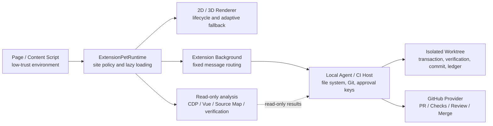

<div align="center">

# YK Pets

**A modular TypeScript platform for browser-based 2D/3D pets, page-aware agents, and controlled development workflows**

[简体中文](./README.md) · [English](./README.en.md) · [版本历史](./CHANGELOG.md) · [Changelog](./CHANGELOG.en.md)

**Platform `0.7.8` · 28 SDK packages · 337 automated tests · stable extension baseline `0.6.10`**

</div>

> [!IMPORTANT]
> The current repository provides composable SDKs, an extension runtime, trusted-host protocols, and integration examples. It is not a finished `.crx` that can be installed directly. Production 3D models, textures, audio assets, a final Manifest, store configuration, and the product UI must be supplied by the host application.

## Contents

- [Project scope](#project-scope)
- [Design principles](#design-principles)
- [Core capabilities](#core-capabilities)
- [Architecture](#architecture)
- [Current status](#current-status)
- [Quick start](#quick-start)
- [Basic integration](#basic-integration)
- [SDK catalog](#sdk-catalog)
- [Repository layout](#repository-layout)
- [Security model](#security-model)
- [Development and verification](#development-and-verification)
- [Version evolution](#version-evolution)
- [Technical documentation](#technical-documentation)
- [Known boundaries](#known-boundaries)
- [Roadmap](#roadmap)
- [Contributing](#contributing)
- [License](#license)

## Project scope

YK Pets aims to become a browser-pet platform that combines emotional presence with practical assistance.

A pet can render a 2D or 3D character, actions, expressions, audio, and thought bubbles on a page. It can also serve as the interaction surface for a controlled agent that helps with:

- page understanding, summaries, and translation;
- document and structured-content processing;
- front-end audits, issue localization, and change reports;
- DOM-to-Vue 2 / Vue 3 source mapping;
- before-and-after verification with Lighthouse and declarative Playwright scenarios;
- source changes approved explicitly by the user;
- commits and allowlisted pushes from isolated Git worktrees;
- Pull Request, Checks, Review, Merge, and post-release cleanup governance.

The project is organized as modular SDKs. The page, Content Script, Extension Background, local Agent Host, CI Host, and GitHub Provider communicate through strict protocols. Shell access, GitHub tokens, arbitrary script execution, and file-system privileges are not exposed to low-trust page code.

## Design principles

### 1. Separate pet experience from work capabilities

Rendering, actions, sound, analysis, source modification, repository publishing, and remote collaboration are independent layers. A host may use only the lightweight 2D pet or progressively add 3D, agent, audit, and development workflows.

### 2. Fail safely by default

If permissions, approvals, content hashes, Git heads, PR snapshots, or verification results do not satisfy the declared requirements, the operation stops instead of attempting a best-effort continuation.

### 3. Lazy-load expensive capabilities

The 3D renderer, audit collectors, deep analysis, safe modification, repository publishing, and remote collaboration modules load only when requested. Ordinary pages do not pay the startup cost of unused development features.

### 4. Keep privileged credentials out of page contexts

Content Scripts and page UIs send declarative requests only. GitHub tokens, HMAC keys, file writes, Git commands, and CI credentials remain in a trusted Background, local Agent Host, or CI Host.

### 5. Make every modification explainable, verifiable, and reversible

A patch plan declares exact paths and hash preconditions. A preview is shown before a one-time approval is issued. Verification runs after the transaction. Failure triggers reverse-order rollback while protecting edits made externally during the operation.

## Core capabilities

### Adaptive pet rendering

- A common `PetRenderer` / `PetRendererFactory` contract;
- detection for unavailable WebGL, context loss, low FPS, long tasks, limited memory, low battery, Save-Data, and reduced-motion preferences;
- state migration between 3D and 2D renderers;
- a texture-free Canvas 2D cloud-fox fallback renderer;
- safe fallback to 2D when 3D initialization or restoration fails;
- renderer suspension when a page is hidden, offscreen, frozen, or entering `pagehide`.

### Browser extension runtime

- Enable, pause, or hide the pet per site;
- select `auto / 2d / 3d` per site;
- independently control audio, interaction, and page audits;
- match origins, wildcard subdomains, paths, ports, priorities, and session overrides;
- re-resolve policy after SPA navigation;
- lazy-load 3D, audit, analysis, modification, repository publishing, and remote-collaboration bundles independently.

### Agent-tool and plugin governance

- Tool capability declarations and exact permission scopes;
- deny-first permission merging;
- one-time confirmation tokens, hard timeouts, abort support, and audit records;
- plugin Manifest validation, semantic-version compatibility, dependency topology, and cycle detection;
- prevention of wildcard privilege expansion by plugins;
- activation of capability providers before consumers.

### Deep page analysis

- An origin-bound, read-only Chrome DevTools Protocol bridge;
- stable DOM selector generation;
- Vue 2 `__vue__` and Vue 3 `__vueParentComponent` ownership detection;
- Inspector metadata and Source Map v3 localization;
- evidence-weighted source candidate ranking and confidence;
- adapter-driven Lighthouse and declarative Playwright comparison;
- structured JSON and Markdown change reports.

### Safe source modification

- Declarative `yk-pets.patch-plan/v1` patch plans;
- create, update, delete, and move operations;
- SHA-256 preconditions, path constraints, and byte budgets;
- file-level compare-and-swap transactions;
- reverse-order rollback on partial failure;
- conflict protection for external concurrent edits;
- automatic recovery after failed verification, exceptions, timeouts, or cancellation.

### Controlled Git publishing

- Isolated Git worktree sessions;
- fixed Git subcommands, argument arrays, and `shell: false`;
- exact staging, commits, and pushes to allowlisted remotes;
- branch, path, diff, secret-scan, verification, and commit-message gates;
- one-time publish approvals;
- append-only SHA-256 hash-chain commit records;
- enforced Draft Pull Request adapters.

### Pull Request lifecycle governance

- A fixed-command GitHub Provider restricted to allowlisted repositories;
- double-read snapshots for PRs, Checks, Reviews, and Review Threads;
- drift detection for head SHA, state, and update time during collection;
- exact reply-and-resolve review plans;
- `eligible / waiting / blocked` merge decisions;
- exact retries for completed failed checks;
- one-time approvals bound to the selected merge method;
- branch and worktree cleanup only after the PR is merged.

## Architecture



### Trust boundaries

| Area | Allowed responsibilities | Must not hold |
|---|---|---|
| Page / Content Script | Render the pet, collect user actions, send declarative requests | GitHub tokens, HMAC keys, arbitrary file privileges, Shell |
| Extension Runtime | Site policy, renderer lifecycle, feature lazy loading | Arbitrary remote APIs or dynamic code execution |
| Extension Background | Fixed message routing and browser API adapters | Unrestricted Shell or arbitrary GitHub URLs |
| Local Agent / CI Host | File transactions, verification, Git, approvals, provider calls | Privileged objects returned to page code |
| GitHub Provider | Fixed PR-lifecycle commands in allowlisted repositories | Arbitrary REST, GraphQL, URLs, or token export |

## Current status

| Item | Status |
|---|---|
| Platform version | `0.7.8` |
| TypeScript SDKs | 28 |
| Automated test baseline | 337 |
| Aggregate exports | 28 / 28 |
| Node.js | `>= 22.0.0` |
| Module format | ESM |
| Stable browser-extension baseline | `0.6.10` |
| Canvas 2D renderer | Included |
| Production 3D renderer and model assets | Supplied by the host project |
| Installable Manifest / store build | Not included in this repository |
| Public npm publication | The documentation does not assume publication to a public registry |

## Quick start

### Requirements

- Node.js 22 or newer;
- npm, preferably with the committed `package-lock.json` for reproducible verification;
- Git;
- a Chromium / Chrome extension development environment for real browser integration;
- trusted adapters for real Lighthouse, Playwright, file-system, Git, or GitHub workflows.

### Install and verify

```bash
git clone https://github.com/yokry-he/yk-pets.git
cd yk-pets

npm ci
npm run validate
```

Run the complete release gate:

```bash
npm run release:verify
```

This performs clean, build, test, release checks, packaging of all 28 SDKs, and offline installation into a fresh temporary project.

> [!NOTE]
> `package.json` records `pnpm@11.13.1`, while the repository also contains `package-lock.json` and the current release-verification scripts use npm. To reproduce the validated baseline, use `npm ci` and avoid rewriting lock files with multiple package managers in the same worktree.

## Basic integration

### Canvas 2D pet

```ts
import { createCanvas2DRendererFactory } from '@yk-pets/pet-renderer-canvas2d'

const host = document.querySelector('#yk-pets-host')!
const factory = createCanvas2DRendererFactory({ width: 240, height: 260 })
const renderer = await factory.create()

await renderer.mount(host)
renderer.update({
  behavior: 'idle',
  emotion: 'happy',
  speaking: false,
})
```

### Site policy

```ts
import {
  MemoryKeyValueStore,
  SitePolicyManager,
} from '@yk-pets/pet-site-policy'

const policies = new SitePolicyManager(new MemoryKeyValueStore())

await policies.addRule({
  id: 'work-sites',
  pattern: 'https://*.example.com/*',
  priority: 100,
  policy: {
    mode: 'enabled',
    renderer: 'auto',
    audioEnabled: false,
    interactionsEnabled: true,
    auditEnabled: true,
  },
})

const resolved = await policies.resolve('https://docs.example.com/project')
```

### Extension runtime

```ts
import { createCanvas2DRendererFactory } from '@yk-pets/pet-renderer-canvas2d'
import { ExtensionPetRuntime } from '@yk-pets/pet-extension-runtime'
import { SitePolicyManager } from '@yk-pets/pet-site-policy'

const runtime = new ExtensionPetRuntime({
  sitePolicies: new SitePolicyManager(),
  renderer2d: createCanvas2DRendererFactory(),
  loadRenderer3d: async () => {
    const module = await import('./renderer-three.js')
    return module.rendererFactory
  },
})

await runtime.start(shadowRoot, location.href, {
  now: Date.now(),
  webglSupported: true,
  reducedMotion: matchMedia('(prefers-reduced-motion: reduce)').matches,
})
```

### Aggregate entry point

```ts
import {
  AdaptiveRendererController,
  PullRequestSynchronizer,
  RemediationRunner,
  RepositoryPublisher,
  SitePolicyManager,
} from '@yk-pets/pet-platform-adaptive'
```

The packages are currently designed first for use inside the monorepo workspace. If they are not available in your registry, consume them through workspace dependencies, local tarballs, or an internal registry.

## SDK catalog

### Rendering and runtime

| Package | Purpose |
|---|---|
| `@yk-pets/pet-runtime-adaptive` | Adaptive 3D/2D selection, health evaluation, state migration, and browser telemetry |
| `@yk-pets/pet-renderer-canvas2d` | Texture-free Canvas 2D cloud-fox fallback renderer |
| `@yk-pets/pet-agent-policy` | Tool capability, permission, confirmation, timeout, and audit governance |
| `@yk-pets/pet-plugin-registry` | Plugin Manifest, compatibility, dependency topology, and lifecycle |
| `@yk-pets/pet-site-policy` | Per-site visibility, renderer, audio, interaction, and audit policy |
| `@yk-pets/pet-runtime-lifecycle` | Page visibility, offscreen, freeze, and site-mode lifecycle control |
| `@yk-pets/pet-feature-loader` | Dependency-aware, cancellable, timeout-bound, deduplicated feature loading |
| `@yk-pets/pet-extension-runtime` | Extension host, fixed messages, and separately authorized capabilities |

### Deep analysis and verification

| Package | Purpose |
|---|---|
| `@yk-pets/pet-devtools-bridge` | Origin-bound, allowlisted, budgeted, redacted read-only CDP bridge |
| `@yk-pets/pet-source-mapper` | DOM, Vue 2/3, Inspector, and Source Map v3 localization |
| `@yk-pets/pet-verification-runner` | Adapter-driven Lighthouse and Playwright before/after verification |
| `@yk-pets/pet-change-report` | Structured issue, source, modification, verification, rollback, and audit reports |

### Safe modification and rollback

| Package | Purpose |
|---|---|
| `@yk-pets/pet-patch-plan` | Path-constrained, hash-bound, deterministically serialized patch plans |
| `@yk-pets/pet-scope-approval` | One-time HMAC approvals for exact paths and write budgets |
| `@yk-pets/pet-file-transaction` | CAS file transactions, reverse rollback, and conflict protection |
| `@yk-pets/pet-project-host` | Fixed Background / CI workspace RPC contracts |
| `@yk-pets/pet-remediation-runner` | Approval, transaction, verification, and recovery orchestration |

### Repository publishing

| Package | Purpose |
|---|---|
| `@yk-pets/pet-repository-policy` | Branch, path, diff, verification, secret, and commit-message gates |
| `@yk-pets/pet-git-worktree` | Isolated worktrees, commits, pushes, leases, and cleanup |
| `@yk-pets/pet-commit-ledger` | Hash-chain records for approvals, commits, pushes, and Draft PRs |
| `@yk-pets/pet-local-agent-host` | Local Git and workspace host with no Shell surface |
| `@yk-pets/pet-repository-publisher` | One-time publish approval and controlled commit, push, Draft PR orchestration |

### Remote collaboration

| Package | Purpose |
|---|---|
| `@yk-pets/pet-github-provider` | Fixed GitHub Provider commands restricted to allowlisted repositories |
| `@yk-pets/pet-pr-lifecycle` | Race-resistant PR, Checks, Reviews, and thread snapshots |
| `@yk-pets/pet-review-governance` | Exact review reply/resolve plans and blocking conditions |
| `@yk-pets/pet-merge-gate` | Merge eligibility based on head, checks, approvals, threads, and freshness |
| `@yk-pets/pet-remote-release` | Approval orchestration for retry, review, merge, and post-merge cleanup |

### Aggregate package

| Package | Purpose |
|---|---|
| `@yk-pets/pet-platform-adaptive` | A single platform entry point exporting the foundation SDKs |

## Repository layout

```text
yk-pets/
├── packages/                    # 28 TypeScript SDKs
├── examples/                    # browser, analysis, modification, Git, and PR examples
├── docs/
│   ├── zh-CN/                   # Chinese technical guides
│   └── en/                      # English technical guides
├── scripts/                     # build, test, release checks, packaging, smoke tests
├── README.md                    # Chinese project README
├── README.en.md                 # English project README
├── CHANGELOG.md                 # Chinese consolidated history and migration/verification notes
├── CHANGELOG.en.md              # English consolidated history and migration/verification notes
├── package.json
├── package-lock.json
└── tsconfig.base.json
```

A package generally contains:

```text
packages/<package>/
├── src/
├── test/
├── dist/
├── README.md
├── package.json
└── tsconfig.json
```

## Security model

### Page-analysis boundary

`pet-devtools-bridge` permanently denies by default:

- `Runtime.evaluate` and arbitrary script execution;
- DOM mutation and input simulation;
- navigation and downloads;
- Cookie, response-body, and cross-origin debugging access;
- script injection.

### File-modification boundary

- Absolute paths, backslashes, and traversal are rejected;
- `.git`, `node_modules`, `.yk-pets/approvals`, and other protected paths are denied;
- updates and deletes bind to the original SHA-256 content;
- approvals bind the patch digest, exact path set, byte budget, and user context;
- rollback reports a conflict instead of overwriting externally changed content.

### Git boundary

- Git uses argument arrays and `shell: false`;
- arbitrary Git subcommands and Shell are not exposed;
- dangerous Hook, Filter, Credential Helper, SSH Command, and URL Rewrite configuration is rejected;
- the actual changed file set must equal the approved set;
- pushes validate both the remote name and normalized URL.

### GitHub boundary

- The Provider exposes fixed commands only;
- the repository must be allowlisted;
- arbitrary REST, GraphQL, and URLs are not available;
- review plans bind the exact head, snapshot, and latest comment ID;
- merge approval binds the selected merge method;
- post-release cleanup is available only for merged PRs.

### Secret management

HMAC keys, GitHub tokens, CI credentials, and local file privileges belong in a trusted host. Hard-coded values in examples are illustrative only. Production deployments require secure secret storage, least privilege, and rotation.

## Development and verification

### Common commands

| Command | Purpose |
|---|---|
| `npm run clean` | Remove rebuildable output |
| `npm run build` | Build all SDKs |
| `npm test` | Run the TypeScript test suite |
| `npm run check` | Run version, package-structure, and source-security gates |
| `npm run validate` | Clean, build, test, and run release checks |
| `npm run pack:sdk` | Pack all npm tarballs |
| `npm run smoke:packages` | Install into a fresh project and verify exports |
| `npm run release:verify` | Run the complete release verification pipeline |

### v0.7.8 verification baseline

- All 28 SDKs built successfully;
- 337 / 337 automated tests passed;
- 28 / 28 aggregate exports were usable;
- the final SDK archive installed offline after re-extraction;
- npm install audit reported 0 vulnerabilities;
- the v0.7.7 → v0.7.8 patch was applied to a fresh baseline and verified for source-tree equivalence;
- the stable browser-extension baseline remained `0.6.10`.

These results cover SDKs, strict protocols, simulated hosts, temporary Git repositories, and offline installation. They do not claim execution against a user's production website, installed browser extension, live GitHub PR, or production CI credentials.

## Version evolution

| Version | Theme | SDKs | Tests |
|---|---|---:|---:|
| `0.7.3` | Platform governance: 2D fallback, agent permissions, plugin governance | 5 | 44 |
| `0.7.4` | Extension runtime: site policy, lifecycle, and lazy loading | 9 | 88 |
| `0.7.5` | Source mapping and deep analysis | 13 | 144 |
| `0.7.6` | Safe source modification, transactions, and rollback | 18 | 206 |
| `0.7.7` | Isolated repositories, controlled commits, pushes, and Draft PRs | 23 | 270 |
| `0.7.8` | Remote collaboration, review governance, and merge gates | 28 | 337 |

Detailed release capabilities, migration steps, security hardening, verification results, and verification boundaries are consolidated in [CHANGELOG.en.md](./CHANGELOG.en.md). Separate per-version Release Notes, Migration, Validation, and Merge Instructions files are no longer maintained.

## Technical documentation

The repository root keeps only the Chinese and English READMEs plus the two consolidated changelogs. Stable topic-oriented guides remain in:

- Chinese: [`docs/zh-CN`](./docs/zh-CN)
- English: [`docs/en`](./docs/en)
- Package-level guides: each [`packages/*/README.md`](./packages)
- Integration examples: [`examples`](./examples)

These documents describe stable APIs and security boundaries rather than temporary release-process state, so they remain separate.

## Known boundaries

1. The repository is not a complete installable extension;
2. Production 3D models, animations, textures, and audio assets are not included;
3. Real Lighthouse, Playwright, Chrome Debugger, file-system, Git, and GitHub workflows require trusted host adapters;
4. Playwright accepts declarative scenarios only, and CDP does not expose `Runtime.evaluate`;
5. Privileged capabilities require separate authorization and cannot be called directly by page code;
6. The documentation does not guarantee that SDKs are published to a public npm registry;
7. The repository does not yet contain a formal `LICENSE` file, so it must not be assumed to use MIT, Apache-2.0, or another open-source license.

## Roadmap

Planned directions include:

- multi-repository dependency-release strategy and release queues;
- standardized webhook / polling events and recovery workflows;
- operational metrics, tracing, and a complete release-audit view;
- a real Chrome MV3 extension and store build pipeline;
- a Three.js cloud-fox renderer, GLB assets, action state machine, and audio management;
- a visual settings page, Side Panel, permission center, and audit center;
- domestic and international model-provider adapters;
- isolated plugin execution, third-party distribution, and signing;
- Windows, macOS, and Linux installers for the local Agent Host.

## Contributing

Suggested workflow:

```bash
git checkout -b yk-pets/your-change
npm ci
npm run validate
```

Before submitting a change:

- keep the scope clear and exclude unrelated files;
- add automated coverage for new behavior;
- update public types and both language versions of the documentation;
- rebuild the relevant `dist` output when SDK exports change;
- do not commit tokens, secrets, `.env`, personal paths, or generated temporary archives;
- expose privileged capabilities through fixed commands, allowlists, and one-time approvals;
- do not introduce file-system, Git, or GitHub credentials into a Content Script or page context.

## License

The repository does not currently contain a formal `LICENSE` file. Until a license is explicitly selected, do not assume the project is MIT, Apache-2.0, or otherwise open source, and do not copy, modify, redistribute, or use its contents commercially without permission.

---

<div align="center">

**YK Pets — a browser pet that is not only delightful, but genuinely useful within explicit safety boundaries.**

</div>
