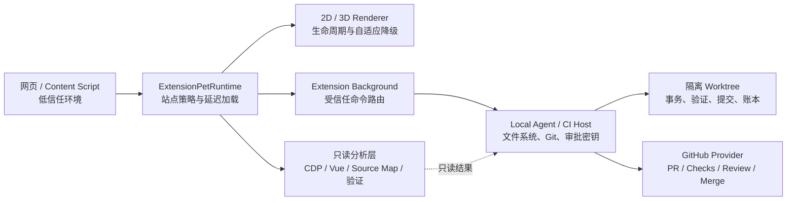

<div align="center">

# YK Pets

**面向浏览器 3D 宠物、页面智能 Agent 与受控开发工作流的模块化 TypeScript 平台**

[简体中文](./README.md) · [English](./README.en.md) · [v0.7.8 发布说明](./RELEASE-NOTES-v0.7.8.md) · [中文验证报告](./VALIDATION-v0.7.8.zh-CN.md)

**当前平台版本：`0.7.8` · SDK：28 个 · 自动测试：337 项 · 浏览器扩展稳定基线：`0.6.10`**

</div>

> [!IMPORTANT]
> YK Pets 当前仓库主要提供 **可组合 SDK、扩展运行时、受信任宿主协议和集成示例**。它不是一个已经打包完成、可以直接拖入浏览器安装的 `.crx` 成品，也不包含生产使用的 3D 模型、贴图、音频资源或完整 Manifest。最终扩展需要由宿主项目补充 3D Renderer、资源、UI、权限声明和构建配置。

## 目录

- [项目简介](#项目简介)
- [设计目标](#设计目标)
- [核心能力](#核心能力)
- [整体架构](#整体架构)
- [当前状态](#当前状态)
- [快速开始](#快速开始)
- [基础使用](#基础使用)
- [SDK 包说明](#sdk-包说明)
- [项目目录](#项目目录)
- [集成示例](#集成示例)
- [安全模型](#安全模型)
- [开发与验证](#开发与验证)
- [版本演进](#版本演进)
- [文档索引](#文档索引)
- [已知边界](#已知边界)
- [路线图](#路线图)
- [参与开发](#参与开发)
- [许可证](#许可证)

## 项目简介

YK Pets 的长期目标，是构建一个既有情感陪伴感、又能真正参与日常工作的浏览器宠物平台。

宠物不仅可以在网页上显示 2D/3D 形象、动作、表情和声音，还可以作为受控 Agent 的交互入口，协助完成：

- 页面信息理解与摘要；
- 文档、翻译和内容处理；
- 前端页面审计与问题定位；
- DOM 到 Vue 2 / Vue 3 源码映射；
- Lighthouse 与声明式 Playwright 修复验证；
- 经用户审批的源码补丁执行；
- 隔离 Git Worktree 中的提交与推送；
- Pull Request、Checks、Review、Merge 和发布后清理治理。

项目采用模块化 SDK 设计。浏览器页面、扩展 Background、本地 Agent Host、CI Host 和 GitHub Provider 之间通过严格接口协作，避免把 Shell、GitHub Token、任意脚本执行能力或文件系统权限直接暴露给网页环境。

## 设计目标

### 1. 宠物体验与工作能力解耦

渲染、动作、声音、页面分析、源码修改和仓库发布是相互独立的能力层。宿主可以只使用轻量 2D 宠物，也可以逐步接入 3D、Agent、审计和开发工作流。

### 2. 默认安全失败

当权限、审批、文件哈希、Git Head、PR 快照或验证结果不满足要求时，操作默认终止，而不是尝试“尽可能继续”。

### 3. 高成本能力延迟加载

3D Renderer、页面审计、深度分析、安全修改、仓库发布和远程协作都可以按需加载，普通网页不会因为未使用的开发能力承担额外启动成本。

### 4. 页面环境不持有高权限凭据

Content Script 和页面 UI 只提交声明式请求。GitHub Token、文件写入、Git 命令、HMAC 密钥和 CI 凭据必须保留在受信任的 Background、本地 Agent Host 或 CI Host 中。

### 5. 所有修改可解释、可验证、可回滚

补丁计划必须描述准确文件范围和哈希前置条件；执行前展示预览并签发一次性审批；执行后运行验证；失败时自动逆序回滚，并对外部并发修改进行冲突保护。

## 核心能力

### 自适应宠物渲染

- 统一的 `PetRenderer` / `PetRendererFactory` 协议；
- WebGL 不可用、上下文丢失、低 FPS、长任务、低内存、低电量和减少动画偏好检测；
- 3D 与 2D Renderer 状态迁移；
- Canvas 2D 云狐兜底渲染器；
- 渲染失败自动回到 2D；
- 后台、离屏、冻结页面暂停渲染。

### 浏览器扩展运行时

- 按站点启用、暂停或隐藏宠物；
- 按站点设置 `auto / 2d / 3d`；
- 分别控制声音、交互和页面审计；
- 支持 Origin、子域通配符、路径、端口、优先级和会话临时覆盖；
- 支持 SPA 导航后重新解析策略；
- 3D、审计、分析、修改、仓库发布和远程协作功能独立延迟加载。

### Agent 工具与插件治理

- 工具能力声明和精确权限范围；
- 拒绝优先的权限合并；
- 一次性确认令牌、超时和审计记录；
- 插件 Manifest 校验、语义版本兼容、依赖拓扑和循环检测；
- 禁止插件使用通配符扩大宿主权限；
- 能力提供者优先于消费者激活。

### 页面深度分析

- Origin 绑定的只读 Chrome DevTools Protocol 桥接；
- DOM 稳定选择器生成；
- Vue 2 `__vue__` 和 Vue 3 `__vueParentComponent` 归属识别；
- Inspector 元数据和 Source Map v3 定位；
- 多证据源码候选排序和置信度；
- Adapter 驱动的 Lighthouse 与声明式 Playwright 前后对比；
- JSON / Markdown 结构化变更报告。

### 安全源码修改

- `yk-pets.patch-plan/v1` 声明式补丁计划；
- 创建、更新、删除和移动文件；
- SHA-256 前置条件和路径约束；
- 文件级 Compare-And-Swap 事务；
- 中途失败自动逆序回滚；
- 外部并发修改冲突保护；
- 验证失败、超时或取消后自动恢复。

### 受控 Git 发布

- 隔离 Git Worktree 会话；
- 固定 Git 子命令和 `shell: false`；
- 精确暂存、提交和允许列表内推送；
- 分支、路径、Diff、密钥扫描、验证和 Commit Message 门禁；
- 一次性发布审批；
- 追加式 SHA-256 哈希链提交账本；
- 强制 Draft Pull Request Adapter。

### Pull Request 生命周期治理

- 仓库允许列表内的固定 GitHub Provider；
- PR、Checks、Reviews 和 Review Threads 前后双读；
- 采集期间 Head 或状态漂移检测；
- Review 回复与 Resolve 精确计划；
- 合并资格 `eligible / waiting / blocked` 判定；
- 失败 Check 精确重试；
- Merge Method 绑定的一次性审批；
- 仅在 PR 已合并后执行分支与 Worktree 清理。

## 整体架构



### 信任边界

| 区域 | 可做什么 | 不应持有什么 |
|---|---|---|
| 网页 / Content Script | 展示宠物、收集用户操作、发送声明式请求 | GitHub Token、HMAC 密钥、任意文件权限、Shell |
| Extension Runtime | 站点策略、Renderer 生命周期、功能延迟加载 | 任意远程 API 和动态代码执行能力 |
| Extension Background | 固定消息路由、浏览器 API 适配 | 无限制 Shell、任意 GitHub URL |
| Local Agent / CI Host | 文件事务、验证、Git、审批和 Provider 调用 | 不应把高权限对象返回页面 |
| GitHub Provider | 仓库允许列表内的固定 PR 生命周期命令 | 任意 REST、GraphQL、URL 或 Token 导出 |

## 当前状态

| 项目 | 状态 |
|---|---|
| 平台版本 | `0.7.8` |
| TypeScript SDK | 28 个 |
| 自动测试基线 | 337 项 |
| 统一入口导出 | 28 / 28 |
| Node.js | `>= 22.0.0` |
| 模块格式 | ESM |
| 浏览器扩展稳定基线 | `0.6.10` |
| Canvas 2D Renderer | 已提供 |
| 生产 3D Renderer 与模型资源 | 由宿主项目提供 |
| 完整可安装扩展 Manifest / 打包配置 | 当前仓库未提供 |
| npm 公共发布 | 当前 README 不假设包已发布到公共 Registry |

## 快速开始

### 环境要求

- Node.js 22 或更高版本；
- npm，建议使用仓库中的 `package-lock.json` 复现验证环境；
- Git；
- 需要运行真实浏览器集成时，准备 Chromium / Chrome 扩展开发环境；
- 需要运行真实 Lighthouse、Playwright、Git 或 GitHub 流程时，提供对应受信任 Adapter。

### 安装与验证

```bash
git clone https://github.com/yokry-he/yk-pets.git
cd yk-pets

npm ci
npm run validate
```

执行完整发布门禁：

```bash
npm run release:verify
```

该命令会依次完成清理、构建、测试、发布检查、28 个 SDK 打包和全新临时项目离线安装验证。

> [!NOTE]
> `package.json` 中记录了 `pnpm@11.13.1`，仓库同时包含 `package-lock.json`，而当前发布验证脚本使用 npm。为了获得和验证报告一致的结果，建议在同一工作树中使用 `npm ci`，不要混用多个包管理器重写锁文件。

## 基础使用

### 1. 使用 Canvas 2D 宠物

```ts
import { createCanvas2DRendererFactory } from '@yk-pets/pet-renderer-canvas2d'

const host = document.querySelector('#yk-pets-host')!
const factory = createCanvas2DRendererFactory({
  width: 240,
  height: 260,
})

const renderer = await factory.create()
await renderer.mount(host)

renderer.update({
  behavior: 'idle',
  emotion: 'happy',
  speaking: false,
})
```

### 2. 配置站点策略

```ts
import {
  MemoryKeyValueStore,
  SitePolicyManager,
} from '@yk-pets/pet-site-policy'

const policies = new SitePolicyManager(new MemoryKeyValueStore())

await policies.addRule({
  id: 'work-sites',
  pattern: 'https://*.example.com/*',
  priority: 100,
  policy: {
    mode: 'enabled',
    renderer: 'auto',
    audioEnabled: false,
    interactionsEnabled: true,
    auditEnabled: true,
  },
})

const resolved = await policies.resolve('https://docs.example.com/project')
console.log(resolved)
```

### 3. 接入扩展运行时

```ts
import { createCanvas2DRendererFactory } from '@yk-pets/pet-renderer-canvas2d'
import { ExtensionPetRuntime } from '@yk-pets/pet-extension-runtime'
import { SitePolicyManager } from '@yk-pets/pet-site-policy'

const host = document.createElement('div')
const shadowRoot = host.attachShadow({ mode: 'open' })
document.documentElement.append(host)

const runtime = new ExtensionPetRuntime({
  sitePolicies: new SitePolicyManager(),
  renderer2d: createCanvas2DRendererFactory(),

  // 3D 实现由宿主项目提供，并在真正需要时动态加载。
  loadRenderer3d: async () => {
    const module = await import('./renderer-three.js')
    return module.rendererFactory
  },
})

await runtime.start(shadowRoot, location.href, {
  now: Date.now(),
  webglSupported: true,
  reducedMotion: matchMedia('(prefers-reduced-motion: reduce)').matches,
})
```

### 4. 使用统一入口

大多数宿主可以从聚合包导入平台 API：

```ts
import {
  AdaptiveRendererController,
  PullRequestSynchronizer,
  RemediationRunner,
  RepositoryPublisher,
  SitePolicyManager,
} from '@yk-pets/pet-platform-adaptive'
```

这些包当前首先作为 Monorepo Workspace 使用。若尚未发布到 npm Registry，请通过工作区依赖、本地 tarball 或内部 Registry 接入，而不要假设 `npm install @yk-pets/...` 在公共网络上一定可用。

## SDK 包说明

### 渲染与运行时

| 包 | 作用 |
|---|---|
| `@yk-pets/pet-runtime-adaptive` | 3D/2D 自适应选择、健康度评估、状态迁移和浏览器运行时采样 |
| `@yk-pets/pet-renderer-canvas2d` | 无贴图依赖的 Canvas 2D 云狐兜底 Renderer |

### 扩展运行时与治理

| 包 | 作用 |
|---|---|
| `@yk-pets/pet-agent-policy` | Agent 工具能力、权限、确认、超时和审计治理 |
| `@yk-pets/pet-plugin-registry` | 插件 Manifest、版本兼容、依赖排序和生命周期管理 |
| `@yk-pets/pet-site-policy` | 按站点启用、暂停、隐藏、Renderer、音频、交互和审计策略 |
| `@yk-pets/pet-runtime-lifecycle` | 页面可见性、离屏、冻结和站点模式生命周期控制 |
| `@yk-pets/pet-feature-loader` | 支持依赖、去重、超时和取消的功能 Bundle 延迟加载 |
| `@yk-pets/pet-extension-runtime` | 统一扩展宿主、固定消息协议和独立授权的可选能力加载 |

### 深度分析与验证

| 包 | 作用 |
|---|---|
| `@yk-pets/pet-devtools-bridge` | Origin 绑定、命令允许列表、预算和脱敏的只读 CDP 桥接 |
| `@yk-pets/pet-source-mapper` | DOM、Vue 2/3、Inspector 元数据和 Source Map v3 源码定位 |
| `@yk-pets/pet-verification-runner` | Adapter 驱动的 Lighthouse 与声明式 Playwright 前后验证 |
| `@yk-pets/pet-change-report` | 问题、源码映射、修改、验证、回滚和审计时间线报告 |

### 安全修改与回滚

| 包 | 作用 |
|---|---|
| `@yk-pets/pet-patch-plan` | 路径受限、哈希绑定、可确定性序列化的补丁计划 |
| `@yk-pets/pet-scope-approval` | 精确文件范围和写入预算的一次性 HMAC 审批 |
| `@yk-pets/pet-file-transaction` | CAS 文件事务、回滚日志和冲突安全恢复 |
| `@yk-pets/pet-project-host` | Background / CI 固定 Workspace RPC 协议 |
| `@yk-pets/pet-remediation-runner` | 审批、事务、验证和失败自动回滚编排 |

### 真实仓库与受控提交

| 包 | 作用 |
|---|---|
| `@yk-pets/pet-repository-policy` | 分支、路径、Diff、验证、密钥和 Commit Message 门禁 |
| `@yk-pets/pet-git-worktree` | 隔离 Worktree 会话、暂存、提交、推送、租约和清理 |
| `@yk-pets/pet-commit-ledger` | Commit、Push、门禁、验证和 Draft PR 的防篡改记录 |
| `@yk-pets/pet-local-agent-host` | 无 Shell 暴露的本地 Git / Workspace Host |
| `@yk-pets/pet-repository-publisher` | 一次性发布审批和提交、推送、Draft PR 编排 |

### 远程协作与 PR 生命周期

| 包 | 作用 |
|---|---|
| `@yk-pets/pet-github-provider` | 仓库允许列表内的固定 GitHub 命令 Provider |
| `@yk-pets/pet-pr-lifecycle` | 防竞态 PR、Checks、Reviews 和 Review Threads 快照 |
| `@yk-pets/pet-review-governance` | 精确 Review 回复、Resolve 计划和阻塞项摘要 |
| `@yk-pets/pet-merge-gate` | 基于 Head、Checks、审批、线程和时效的合并资格判断 |
| `@yk-pets/pet-remote-release` | 重试、Review、Merge 和合并后清理的一次性审批与编排 |

### 聚合入口

| 包 | 作用 |
|---|---|
| `@yk-pets/pet-platform-adaptive` | 统一导出全部 27 个基础 SDK 的平台入口 |

## 项目目录

```text
yk-pets/
├── packages/                 # 28 个 TypeScript SDK
│   ├── pet-runtime-adaptive/
│   ├── pet-extension-runtime/
│   ├── pet-source-mapper/
│   ├── pet-remediation-runner/
│   ├── pet-repository-publisher/
│   ├── pet-remote-release/
│   └── ...
├── examples/                 # 浏览器、分析、修改、Git 和 PR 生命周期接入示例
├── docs/
│   ├── zh-CN/                # 中文模块文档
│   └── en/                   # 英文模块文档
├── scripts/                  # 构建、测试门禁、SDK 打包和离线安装验证
├── README.md                 # 项目主文档
├── README.en.md              # 英文简介
├── RELEASE-NOTES-v*.md       # 各版本发布说明
├── MIGRATION-v*.md           # 版本迁移指南
├── VALIDATION-v*.md          # 验证报告
├── package.json
├── package-lock.json
└── tsconfig.base.json
```

每个 SDK 通常包含：

```text
packages/<package>/
├── src/                      # TypeScript 源码
├── test/                     # Node Test Runner 测试
├── dist/                     # 可重建的 ESM 与类型声明产物
├── package.json
└── tsconfig.json
```

## 集成示例

| 示例 | 说明 |
|---|---|
| [`examples/adaptive-browser.ts`](./examples/adaptive-browser.ts) | 3D/2D 自适应 Renderer 接入 |
| [`examples/extension-runtime.ts`](./examples/extension-runtime.ts) | Content Script / Extension Runtime 接入 |
| [`examples/site-policy.ts`](./examples/site-policy.ts) | 站点规则与临时会话策略 |
| [`examples/tool-policy.ts`](./examples/tool-policy.ts) | Agent 工具权限治理 |
| [`examples/deep-analysis.ts`](./examples/deep-analysis.ts) | CDP、源码映射和深度分析编排 |
| [`examples/source-mapping.ts`](./examples/source-mapping.ts) | DOM 到 Vue / Source Map 定位 |
| [`examples/verification.ts`](./examples/verification.ts) | Lighthouse / Playwright 前后验证 |
| [`examples/change-report.ts`](./examples/change-report.ts) | 结构化变更报告 |
| [`examples/safe-remediation.ts`](./examples/safe-remediation.ts) | 审批、文件事务、验证和回滚 |
| [`examples/background-workspace.ts`](./examples/background-workspace.ts) | Extension Background Workspace Host |
| [`examples/ci-workspace.ts`](./examples/ci-workspace.ts) | CI Workspace Host |
| [`examples/local-repository-host.ts`](./examples/local-repository-host.ts) | 真实本地 Git Host |
| [`examples/controlled-repository-publish.ts`](./examples/controlled-repository-publish.ts) | 受控 Commit 与 Push |
| [`examples/extension-repository-publish.ts`](./examples/extension-repository-publish.ts) | 扩展仓库发布入口 |
| [`examples/github-collaboration-host.ts`](./examples/github-collaboration-host.ts) | 固定 GitHub Provider Host |
| [`examples/controlled-pr-lifecycle.ts`](./examples/controlled-pr-lifecycle.ts) | PR 同步、重试和 Merge Gate |
| [`examples/extension-collaboration.ts`](./examples/extension-collaboration.ts) | 扩展远程协作入口 |

## 安全模型

YK Pets 的安全设计不是单一权限开关，而是多层约束共同生效。

### 页面分析边界

`pet-devtools-bridge` 默认永久禁止：

- `Runtime.evaluate`；
- DOM 修改；
- 输入模拟；
- 导航和下载；
- Cookie 读取；
- 响应体读取；
- 任意脚本注入；
- 跨 Origin 调试目标。

### 文件修改边界

- 禁止绝对路径、反斜杠和目录穿越；
- 禁止修改 `.git`、`node_modules`、`.yk-pets/approvals` 等保护路径；
- 更新和删除必须绑定原内容 SHA-256；
- 每次审批绑定精确补丁摘要、文件集合和字节预算；
- 审批只能消费一次；
- 回滚检测到外部修改时报告冲突，不覆盖用户的新内容。

### Git 边界

- Git 通过参数数组调用，`shell: false`；
- 不提供任意 Git 子命令和 Shell；
- 拒绝 Hook、Filter、Credential Helper、SSH Command 和 URL Rewrite 等危险配置；
- 不直接修改保护分支工作树；
- 实际变更文件必须与批准范围完全一致；
- Push 同时校验远端名称和规范化 URL。

### GitHub 边界

- Provider 只允许固定命令；
- 仓库必须位于允许列表；
- 不开放任意 REST、GraphQL 或 URL；
- Review 计划绑定精确 Head、快照和最新评论 ID；
- Merge 审批绑定 Merge Method；
- 同名必需 Check 出现歧义时禁止合并；
- 只有已合并 PR 才允许执行发布后清理。

### 密钥管理

HMAC 密钥、GitHub Token、CI 凭据和本地文件系统句柄只能保存在受信任宿主。示例中使用的固定字节数组仅用于演示，生产环境必须替换为安全密钥存储。

## 开发与验证

### 常用命令

| 命令 | 作用 |
|---|---|
| `npm run clean` | 清理可重建输出 |
| `npm run build` | 构建全部 SDK |
| `npm test` | 运行全部 TypeScript 测试 |
| `npm run check` | 执行版本、包结构和安全源码门禁 |
| `npm run validate` | 清理、构建、测试和发布检查 |
| `npm run pack:sdk` | 将所有 SDK 打包为 npm tarball |
| `npm run smoke:packages` | 在全新临时项目中离线安装并验证统一导出 |
| `npm run release:verify` | 执行完整发布验证流程 |

### 当前验证基线

v0.7.8 已验证：

- 28 个 TypeScript SDK 构建成功；
- 337 / 337 自动测试通过；
- 28 / 28 统一入口导出可用；
- 最终 SDK 压缩包重新解压后离线安装成功；
- npm 安装审计为 0 个漏洞；
- v0.7.7 → v0.7.8 Patch 在全新基线上应用成功；
- Patch 应用后过滤源码树逐文件等价。

详细结果见 [`VALIDATION-v0.7.8.zh-CN.md`](./VALIDATION-v0.7.8.zh-CN.md)。

## 版本演进

| 版本 | 主题 | 主要能力 |
|---|---|---|
| `0.7.3` | 平台治理层 | 2D 自动降级、Agent 权限、插件清单与兼容机制 |
| `0.7.4` | 扩展运行时整合 | 站点策略、生命周期暂停、3D 与审计延迟加载 |
| `0.7.5` | 源码映射与深度分析 | 只读 CDP、Vue 源码定位、验证编排、变更报告 |
| `0.7.6` | 安全修改与回滚 | 补丁计划、精确审批、文件事务和自动恢复 |
| `0.7.7` | 真实仓库与受控提交 | Worktree、提交门禁、Push、账本和 Draft PR |
| `0.7.8` | 远程协作生命周期 | GitHub Provider、PR 同步、Review、Merge Gate 和清理 |

迁移说明位于根目录的 `MIGRATION-v*.md`，各版本详细变化位于 `RELEASE-NOTES-v*.md`。

## 文档索引

### 运行时与扩展

- [自适应渲染](./docs/zh-CN/ADAPTIVE-RENDERING-v0.7.3.md)
- [Agent 权限](./docs/zh-CN/AGENT-PERMISSIONS-v0.7.3.md)
- [插件系统](./docs/zh-CN/PLUGIN-SYSTEM-v0.7.3.md)
- [扩展整合](./docs/zh-CN/EXTENSION-INTEGRATION-v0.7.4.md)
- [站点控制](./docs/zh-CN/SITE-CONTROL-v0.7.4.md)
- [运行时生命周期](./docs/zh-CN/RUNTIME-LIFECYCLE-v0.7.4.md)

### 分析与验证

- [DevTools Bridge](./docs/zh-CN/DEVTOOLS-BRIDGE-v0.7.5.md)
- [源码映射](./docs/zh-CN/SOURCE-MAPPING-v0.7.5.md)
- [验证 Runner](./docs/zh-CN/VERIFICATION-v0.7.5.md)
- [变更报告](./docs/zh-CN/CHANGE-REPORT-v0.7.5.md)

### 修改与回滚

- [补丁计划](./docs/zh-CN/PATCH-PLAN-v0.7.6.md)
- [作用域审批](./docs/zh-CN/SCOPE-APPROVAL-v0.7.6.md)
- [文件事务](./docs/zh-CN/FILE-TRANSACTION-v0.7.6.md)
- [Project Host](./docs/zh-CN/PROJECT-HOST-v0.7.6.md)
- [Remediation](./docs/zh-CN/REMEDIATION-v0.7.6.md)

### Git 与仓库发布

- [仓库策略](./docs/zh-CN/REPOSITORY-POLICY-v0.7.7.md)
- [Git Worktree](./docs/zh-CN/GIT-WORKTREE-v0.7.7.md)
- [提交账本](./docs/zh-CN/COMMIT-LEDGER-v0.7.7.md)
- [本地 Agent Host](./docs/zh-CN/LOCAL-AGENT-HOST-v0.7.7.md)
- [仓库发布](./docs/zh-CN/REPOSITORY-PUBLISH-v0.7.7.md)

### GitHub 与 PR 生命周期

- [GitHub Provider](./docs/zh-CN/GITHUB-PROVIDER-v0.7.8.md)
- [PR 生命周期](./docs/zh-CN/PR-LIFECYCLE-v0.7.8.md)
- [Review 治理](./docs/zh-CN/REVIEW-GOVERNANCE-v0.7.8.md)
- [Merge Gate](./docs/zh-CN/MERGE-GATE-v0.7.8.md)
- [远程发布](./docs/zh-CN/REMOTE-RELEASE-v0.7.8.md)

英文文档位于 [`docs/en`](./docs/en)。

## 已知边界

当前仓库仍有以下边界，接入时需要明确：

1. **不是完整扩展成品**：没有最终 Manifest、商店发布配置和浏览器安装包。
2. **未包含生产 3D 资源**：3D 模型、骨骼动画、贴图、声音和 Three.js Renderer 由宿主提供。
3. **真实工具依赖 Adapter**：Lighthouse、Playwright、Chrome Debugger、文件系统、Git 和 GitHub 都需要受信任宿主实现接口。
4. **不会执行任意脚本**：Playwright 使用声明式场景，CDP 不开放 `Runtime.evaluate`，Git Host 不开放 Shell。
5. **不自动获得权限**：页面审计、源码修改、仓库发布和远程协作需要相互独立的授权。
6. **不保证公共 npm 可安装**：SDK 是否发布到公共 Registry 取决于后续发布流程。
7. **尚无正式许可证文件**：在添加 `LICENSE` 前，不应默认认为仓库内容可自由复制、修改或商用。

## 路线图

下一阶段建议围绕以下方向推进：

- 多仓库发布策略和依赖拓扑；
- Webhook / 轮询事件标准化；
- 发布队列、幂等恢复与失败重试；
- 操作指标、Tracing 和完整审计视图；
- 真实 Chrome MV3 扩展工程和商店构建流程；
- Three.js 云狐 Renderer、GLB 模型、动作状态机和音频资源管理；
- 可视化设置页、Side Panel、权限中心和审计中心；
- 国产大模型与 OpenAI 兼容 Provider Adapter；
- 插件隔离执行和第三方插件分发机制；
- Windows、macOS 和 Linux 本地 Agent Host 安装器。

## 参与开发

推荐流程：

```bash
git checkout -b yk-pets/your-change
npm ci

# 开发并补充测试
npm run validate

# 涉及发布包时执行完整门禁
npm run release:verify
```

提交前请确保：

- 变更范围清晰，不混入无关文件；
- 新行为有自动测试；
- 公共 API 同步更新类型声明和文档；
- 影响 SDK 输出时重新构建对应 `dist`；
- 不提交 Token、密钥、`.env`、个人路径和生成的 `.tgz`；
- 高权限能力继续通过固定命令、允许列表和一次性审批暴露；
- 不在 Content Script 或页面环境中引入文件系统、Git 或 GitHub 凭据。

## 许可证

当前仓库尚未包含正式 `LICENSE` 文件。版权所有者应在对外分发或接受外部贡献前明确许可证。许可证确定之前，请勿默认将本项目视为 MIT、Apache-2.0 或其他开源许可证项目。

---

<div align="center">

**YK Pets — 让浏览器宠物不仅可爱，也能在明确边界内真正帮助你工作。**

</div>
