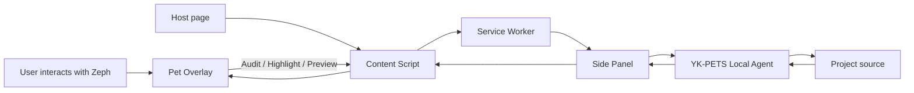

# YK-PETS Browser Agent Technical Architecture

## 1. Product, pet, and implementation layers

Starting from the `v0.6.10` platform branch, YK-PETS separates:

```text
Product brand: YK-PETS
Pet identity: Zeph / 云灵
Pet species: Cloud Fox / 云狐
Current renderer: Vue + TresJS procedural 3D model
```

Product features and protocols must not depend on a pet's display name. Species-specific motions are allowed only behind explicit capabilities and fallback behavior.

## 2. Monorepo

```text
yk-pets/
├── apps/
│   ├── extension/          WXT + Vue 3 + TresJS browser extension
│   └── playground/         3D pet and audit lab
├── packages/
│   ├── shared/             Brand, pet identity, audit data, and protocols
│   └── local-agent/        Node.js local-project Agent
├── docs/                   Product, architecture, security, and development docs
└── pnpm-workspace.yaml
```

The private `@nova/*` workspace scope remains only as a `v0.6.10` compatibility boundary. New public domain concepts use YK-PETS naming.

## 3. Shared domain layer

`packages/shared/src/brand.ts` defines:

- `YK_PETS_BRAND`;
- `PetIdentity`;
- `ZEPH_CLOUD_FOX_IDENTITY`;
- localized pet-name and species formatting helpers.

The current identity is:

```text
id          zeph
speciesId   cloud-fox
name        Zeph / 云灵
species     Cloud Fox / 云狐
```

The canonical types in `packages/shared/src/messages.ts` are:

- `YkPetAction`;
- `YkPetBehavior`;
- `YkPetVisualState`;
- `YkPetVoicePreset`;
- `YkPetsRuntimeMessage`.

Deprecated `Nova*` aliases remain available. Existing `NOVA_*` wire values are intentionally stable for one compatibility cycle so the rebrand does not simultaneously break Background, Content Script, and Side Panel communication.

## 4. Browser extension

### Background Service Worker

Responsibilities:

- open the Side Panel;
- receive audit and network results;
- persist reports and pending actions by tab;
- relay state between Side Panel and Content Script;
- provide TTS and extension-level capabilities.

It does not treat in-memory state as the single source of truth.

### Content Script

Responsibilities:

- install performance observers at `document_start`;
- audit DOM, resources, accessibility, and basic performance;
- mount Zeph's 3D overlay in an isolated Shadow DOM;
- manage finding navigation, highlighting, previews, and motion feedback;
- delegate high-risk engineering operations to Background and Side Panel.

### YK-PETS brand compatibility layer

`apps/extension/brand.ts` centralizes:

- replacement of legacy user-facing NOVA wording;
- pet-specific display as Zeph（云灵）;
- continuous observation of normal DOM and open Shadow Roots;
- one-time migration from `nova:*` to `yk-pets:*`;
- bidirectional storage-key mirroring during the compatibility period.

This is an explicit transition boundary that can be removed after components are natively renamed.

### In-page 3D Pet Overlay

Responsibilities:

- live in the bottom-right corner and support dragging;
- translate click, double-click, context-menu, and hover into constrained pet actions;
- run audits, navigate findings, highlight, preview, and undo in-page;
- delegate Agent connection, patch generation, writes, verification, and rollback;
- express system state through Zeph's mood, motion, voice, and readable text.

### Side Panel

Responsibilities:

- display page health, metrics, and findings;
- manage audit rules and Network Lab;
- connect to the local WebSocket Agent;
- present source candidates, diffs, apply, rollback, and check output;
- synchronize execution state back to the in-page pet.

## 5. Pet identity and motion model

Generic system state and species-specific motions must be separated:

```text
Generic states: idle, thinking, happy, confused, excited, listening
Generic intents: greet, inspect, celebrate, warn, rest, play
Cloud Fox motions: tail-tornado, antenna-charge, tail-glow, ...
```

`YkPetBehavior` still contains historical motion values for `v0.6.10` stability. The next phase should resolve generic intents through a pet definition:

```ts
interface PetDefinition {
  identity: PetIdentity
  capabilities: readonly string[]
  resolveIntent(intent: string): string
  loadRenderer(): Promise<unknown>
}
```

## 6. Audit engine

Current coverage includes accessibility, performance, SEO, DOM quality, viewport configuration, and mixed content. The score is an ordering and explanation aid, not a replacement for Lighthouse or real-user monitoring.

## 7. Local Agent

The Local Agent listens only on:

```text
127.0.0.1:<port>
```

At startup it:

1. resolves and validates the project root;
2. reads `.yk-pets/agent.json` first;
3. migrates the token and port from `.nova/agent.json` when needed;
4. detects package manager, framework, and allowed scripts;
5. starts a token-authenticated WebSocket service.

The primary CLI is `yk-pets-agent`; `nova-agent` remains a temporary alias.

## 8. Security boundaries

- The browser pet emits only constrained actions, never arbitrary commands or file paths.
- The Local Agent accesses only the selected project root.
- Writes validate paths and SHA-256 hashes.
- Applying a patch always requires user confirmation.
- Only `typecheck`, `test`, and `build` are permitted checks.
- Backups are created before writes, and changed files are not overwritten or rolled back blindly.

## 9. Data flow



## 10. Target platform packages

```text
packages/
├── pet-core/          Framework-independent state, events, scheduling, lifecycle
├── pet-cloud-fox/     Cloud Fox capabilities, motions, assets, renderer
├── pet-web/           DOM, Shadow DOM, and plain JavaScript API
├── pet-web-component/ <yk-pet> standard component
└── adapter-*/         Thin React, Vue, Svelte, and other adapters
```

Zeph will become the first `PetDefinition`, not a permanent hard-coded singleton.
