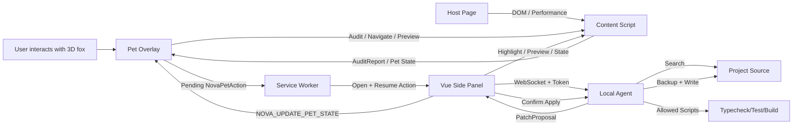

# NOVA Browser Agent Technical Architecture

## 1. Monorepo

```text
nova-browser-agent/
├── apps/
│   ├── extension/          WXT + Vue 3 + TresJS browser extension
│   └── playground/         Original NOVA Nuxt 3D pet and audit lab
├── packages/
│   ├── shared/             Audit data models and WebSocket protocol
│   └── local-agent/        Node.js local-project Agent
├── docs/                   Product, architecture, security, protocol, and development documentation
└── pnpm-workspace.yaml
```

## 2. Browser extension

### Background Service Worker

Responsibilities:

- Open the Side Panel.
- Receive audit reports from the Content Script.
- Persist the latest report for each tab in `chrome.storage.local`.
- Relay necessary state between the Side Panel and the Content Script.
- Persist animal-triggered Side Panel actions in `chrome.storage.local` so commands survive Side Panel initialization delay.

The Service Worker does not hold unique in-memory state, preventing data loss when it sleeps.

### Content Script

Execution scope: `http://*/*` and `https://*/*`.

Responsibilities:

- Register LCP, CLS, and Long Task observers at `document_start`.
- Run DOM and resource audits after the page becomes ready.
- Mount a Shadow DOM-isolated Vue + TresJS 3D cloud fox during browser idle time.
- Maintain the quick-action menu, active issue index, preview state, and animation feedback.
- Delegate high-risk engineering actions to the Background Service Worker and Side Panel.
- Draw the issue-element highlight layer.
- Save temporary-preview snapshots and support rollback.

Not responsible for:

- Reading local source code.
- Writing project files.
- Executing arbitrary page scripts.
- Reading local source code or directly executing arbitrary project commands.

### In-page 3D Pet Overlay

Responsibilities:

- Stay fixed to the bottom-right of the host page and support dragging.
- Convert click, double-click, right-click, and hover into constrained `NovaPetAction` values.
- Execute page audit, issue navigation, locate, preview, and undo directly.
- Delegate Agent connection, patch generation, write, verification, and rollback to the Side Panel.
- Receive `NOVA_UPDATE_PET_STATE` from the Side Panel and synchronize animation, copy, and busy state.

### Side Panel

Responsibilities:

- Display page health, metrics, and issue lists.
- Send locate and preview commands to the Content Script.
- Connect directly to the local WebSocket Agent.
- Display source candidates, diffs, apply/rollback controls, and check results.
- Consume pending animal actions persisted by the Service Worker.
- Synchronize Local Agent state back to the in-page 3D cloud fox.

Three.js and TresJS are used by the in-page Pet Overlay and isolated from the host page through Shadow DOM. The component initializes during browser idle time, with a transparent canvas and constrained DPR.

## 3. Audit engine

Current rules:

| Category | Rules |
|---|---|
| Accessibility | Image alt text, form labels, button names, link names, heading order |
| Performance | Image dimensions, below-the-fold lazy loading, large resources, slow navigation, Long Tasks |
| SEO | Document title and meta description |
| DOM | Duplicate IDs and DOM size |

Scoring:

```text
Start at 100
High priority -12
Medium priority -6
Low priority -2
Minimum score 0
```

The score is a prioritization aid and does not replace Lighthouse or real-user monitoring.

## 4. Local Agent

The Local Agent listens only on:

```text
127.0.0.1:<port>
```

Startup sequence:

1. Resolve the project root with `realpath`.
2. Confirm that the directory is readable and writable.
3. Read or generate a connection token in `.nova/agent.json`.
4. Detect the package manager, framework, and project scripts.
5. Start the WebSocket server.

### Source mapping

A browser issue carries:

- CSS selector
- `tagName`
- An `outerHTML` excerpt
- `id`, `name`, `placeholder`, `src`, `href`, and visible text
- Search keywords and preferred extensions

The Agent searches these source types:

```text
.vue .tsx .jsx .html .svelte .astro
```

Excluded paths:

```text
node_modules .git .nuxt .output dist build coverage
```

Each candidate receives a score based on keyword frequency and evidence stability. If no high-confidence target is found, the Agent returns candidate files only and does not create an applicable patch.

### Patch lifecycle

```text
PROPOSED
  ├─ canApply=false → Suggestions/candidates only
  └─ canApply=true
       ↓ User confirmation
     APPLIED
       ├─ Run checks
       └─ Roll back
```

Checks before writing:

- The path must remain inside the project root.
- The current file SHA-256 must match the value recorded during patch generation.
- A backup must be written to `.nova/backups/<patch-id>.json` first.
- The browser cannot submit an arbitrary file path for writing.

Checks before rollback:

- The current file must still match the post-patch SHA-256.
- If the developer continued editing the file, automatic overwrite is refused.

## 5. Deterministic repair rules

The MVP creates automatic patches only for:

- `image-alt-missing`
- `image-dimensions-missing`
- `image-lazy-missing`
- `form-label-missing`
- `button-name-missing`
- `link-name-missing`

Other issues return candidate files and manual guidance only.

## 6. Check execution

Allowed scripts are fixed to:

```text
typecheck
test
build
```

The Agent reads `package.json` to determine whether each script exists and executes it with the detected package manager:

```text
pnpm run <script>
npm run <script>
yarn run <script>
bun run <script>
```

It does not accept command text from the browser, does not concatenate shell strings, uses a default 120-second timeout, and limits captured output.

## 7. Data flow



## 8. Animal action routing

`NovaPetAction` is the finite action set exposed by the browser interaction layer:

```text
audit
previous-issue
next-issue
preview-current
rollback-preview
open-report
connect-agent
generate-patch
apply-patch
run-checks
rollback-patch
```

The first five actions are handled directly by the Content Script in the active page. The remaining actions are persisted by the Service Worker and delegated to the Side Panel. The browser animal cannot carry arbitrary code, command text, or file paths.
