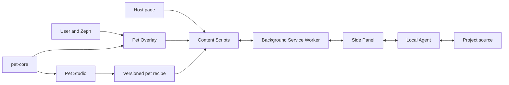

# YK-PETS Browser Agent Technical Architecture

## 1. Architecture goals

YK-PETS models product brand, pet identity, pet species, and renderer implementation separately. The default pet is Zeph, a Cloud Fox, but audits, memory, network tooling, the Local Agent, and generic motion contracts do not depend on that name.

The architecture prioritizes reliable state across page and Service Worker restarts, independently testable domains, a strict browser-to-source trust boundary, one production 3D rendering path, and gradual compatibility for legacy `NOVA` identifiers.

## 2. Monorepo

```text
apps/extension             WXT + Vue 3 browser extension
apps/playground            Nuxt Playground and Pet Studio
packages/shared            Cross-runtime protocols, audit, network, and memory models
packages/local-agent       Local WebSocket Agent
packages/pet-core          Framework-neutral pet, motion, and prop domains
packages/pet-vue-adapter   Vue renderer adapter
packages/pet-web-component <yk-pet> Custom Element shell
scripts                    Architecture contracts and focused regression gates
docs                       Bilingual product and engineering documentation
.ai                        Machine-readable state and session handoff
```

See the [technology stack](./TECH-STACK.md) for dependency-level details.

## 3. Layers and dependency direction

Presentation contains Vue pages, Side Panel components, and the content overlay. Application code orchestrates use cases and services. Domain code owns audit, network, motion, prop, recipe, and state contracts. Infrastructure adapts Chrome APIs, the DOM, WebSocket, file system, and Local Storage.

Dependencies point inward. Domain code does not depend on Vue, Chrome APIs, the DOM, WebSocket, or the file system. External data is validated or normalized before entering a domain.

## 4. Browser extension

The Background Service Worker manages Side Panel lifecycle, tab-scoped reports and actions, message routing, TTS, and extension commands. Durable state lives in `chrome.storage`, not only in Service Worker memory.

Content Scripts install performance and network observers, run DOM/accessibility/SEO/resource audits, mount Zeph and highlights in Shadow DOM, provide reversible previews, bridge Fetch/XHR across execution worlds, and receive Studio recipes.

The Side Panel owns long-running engineering work: reports, Network Lab, Pet Memory, runtime preferences, Local Agent connection, source candidates, diffs, application, checks, and rollback. In-page pet actions are allowlisted and cannot bypass confirmation.

Network Lab separates pure rule creation, matching, conflicts, and value cloning from Chrome repositories, page channels, composables, and Vue pages.

## 5. Playground and Pet Studio

The Nuxt Playground hosts audit experiments, pet interaction, and four Studio workspaces:

- `/studio/appearance` for appearance recipes;
- `/studio/motion` for motion assets, timeline, curves, layers, and direct manipulation;
- `/studio/props` for parametric props, hierarchy, materials, anchors, and local GLB;
- `/studio/library` for appearance, motion, and prop asset management.

Pinia stores local Studio sessions and versioned assets. Appearance, motion, and props retain independent identities. Motion poses do not mutate appearance recipes, and prop deletion cleans motion dependencies.

## 6. Canonical 3D rendering path

`ExtensionAlignedCloudFox.vue` is the sole production Cloud Fox composition. `CloudFoxStudioCanvas.vue` is the canonical preview, and the extension reuses the production composition through a WXT alias. Species dispatch, scene effects, props, onion guides, and trajectories share one TresCanvas.

```text
StudioMotionAssetV2
  -> normalizeMotionAsset
  -> resolveMotionTime
  -> evaluateNormalizedMotionAsset
  -> EvaluatedCloudFoxPose
  -> CloudFoxStudioCanvas
  -> ProceduralPet
  -> ExtensionAlignedCloudFox
  -> semantic part adapters
```

Evaluation occurs once per frame. Unauthored channels keep procedural breathing, blinking, gaze, and expression.

## 7. Shared domain packages

`pet-core` owns species definitions, versioned recipe envelopes, renderer registration, Studio sync, the semantic rig, motion time, keyframes, interpolation, layers, direct authoring commands, prop entities, and event tracks. Its critical behavior is deterministic without a browser.

`shared` owns brand and identity, audit reports, extension messages, Local Agent protocol, network rules, Pet Memory, and runtime preferences. The `@nova/shared` package name remains only as a `v0.6.10` compatibility boundary.

`pet-vue-adapter` connects renderer contracts to Vue, while `pet-web-component` exposes the `<yk-pet>` Custom Element shell. Adapters remain thin and do not duplicate domain rules.

## 8. Local Agent

The Local Agent binds only to `127.0.0.1` and requires a token-authenticated `hello` message. It fixes the project root, detects allowed scripts, finds constrained source candidates, generates deterministic minimal patches, displays diffs, verifies SHA-256 before writes, creates backups, runs allowlisted checks, and rolls back only when hashes remain safe.

The browser cannot supply arbitrary shell commands, absolute file paths, or remote scripts.

## 9. Primary data flow


```mermaid
flowchart LR
  Page[Host page] --> Content[Content Scripts]
  User[User and Zeph] --> Overlay[Pet Overlay]
  Overlay --> Content
  Content <--> Background[Background Service Worker]
  Background <--> Side[Side Panel]
  Side <--> Agent[Local Agent]
  Agent <--> Source[Project source]
  Studio[Pet Studio] --> Recipe[Versioned pet recipe]
  Recipe --> Content
  Core[pet-core] --> Studio
  Core --> Overlay
```

## 10. State and persistence

- `chrome.storage`: extension reports, rules, memory, preferences, and compatibility mirrors;
- Local Storage: Playground appearance, Studio session, motion, and prop assets;
- `.yk-pets/agent.json`: Local Agent port and token;
- `.nova/`: legacy configuration migration and current patch-backup compatibility boundary;
- memory: playhead, temporary drafts, connection sessions, and unapplied patches.

Persistent format changes require normalization, migration, or compatibility reads.

## 11. Security and failure boundaries

Page and imported data is validated before domain use. Shadow DOM limits style conflicts but is not a security sandbox. Patch generation, application, validation, and rollback remain separate operations. Agent or extension restarts may invalidate in-memory sessions and must produce explicit feedback. Static checks do not replace real Chrome, Side Panel, GPU, WebGL, and audio acceptance.

See the [security design and threat model](./SECURITY.md).

## 12. Current evolution boundary

The framework-neutral motion and prop domains, four-workspace Studio, canonical Cloud Fox renderer, extension recipe sync, and foundational Web Component are implemented. Current work focuses on browser acceptance, screenshot baselines, and release hardening. True model raycasting and a three-axis 3D gizmo remain incomplete.
