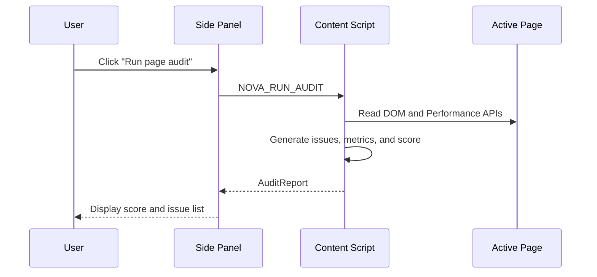
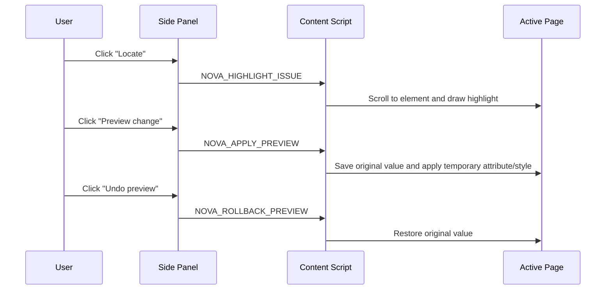
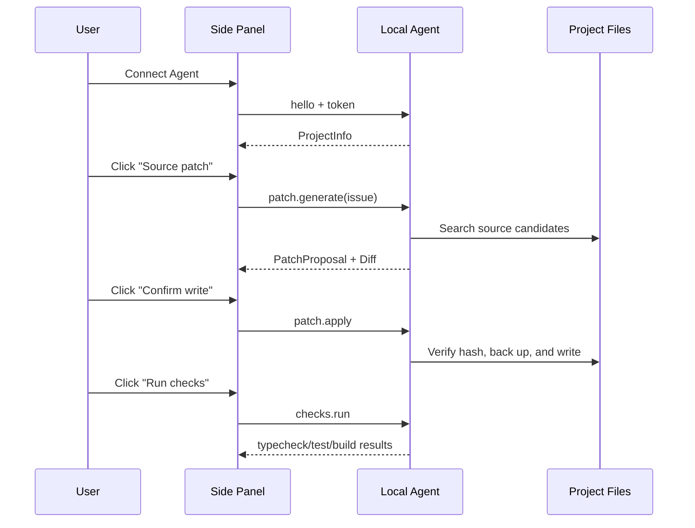

# NOVA Browser Agent Product and Interaction Design

## 1. Product definition

NOVA Browser Agent is a 3D frontend-engineering Agent that lives in the bottom-right corner of every page where the extension is allowed to run. Clicking, double-clicking, right-clicking, hovering, or dragging the cloud fox can start audits, navigate findings, preview fixes, and open engineering operations. The Side Panel remains the detailed workspace for reports, diffs, and command output. Once connected to the local CLI, NOVA can map a suggestion to source code, generate a minimal patch, run verification, and roll back the change—with explicit user confirmation at every write boundary.

Core product flow:

```text
Observe page → Explain issue → Locate element → Preview temporarily → Generate source patch → User confirms → Verify → Keep or roll back
```

The NOVA cloud fox is not decorative. It communicates system state:

| System state | Cloud-fox behavior |
|---|---|
| Audit not started | Leans in and listens |
| Auditing | Thinks while the core pulses |
| Page is healthy | Looks happy and wags its tail |
| High-priority issue | Tilts its head in confusion |
| Generating patch | Thinks while orbit lights accelerate |
| Patch applied | Celebrates excitedly |
| Page condition is poor | Lies down to rest |

## 2. Target users

### Frontend developers

Developers who want to find verifiable issues quickly while working on localhost projects, then locate the related source code, review a diff, and run project scripts without leaving the browser.

### Product, design, and QA teams

People who want to inspect staging or production pages visually, identify a specific element, and preview an improvement without needing to edit code directly.

### Technical leads

Leads who want audit findings to become a repeatable engineering workflow while ensuring that every automated change remains reviewable, verifiable, and reversible.

## 3. MVP goals

This version implements:

1. An interactive 3D NOVA cloud fox injected into the bottom-right corner of ordinary HTTP/HTTPS pages.
2. Clear semantics for click, double-click, right-click, hover, and drag interactions.
3. Audit, issue navigation, location, preview, patch, verification, and rollback workflows that can all be initiated from the animal.
4. Side Panel opening from the toolbar, the animal menu, or the page entry point.
3. DOM, accessibility, SEO, resource, and basic performance audits for the active page.
4. Highlighting of the affected element in the original page.
5. Immediate preview and rollback for safe attribute-level changes.
6. A connection to the local Agent at `ws://127.0.0.1:4736`.
7. Source candidate search based on stable element evidence.
8. Minimal source patches for a limited set of deterministic issues.
9. File writes only after an explicit user click.
10. Allowlisted execution of `typecheck`, `test`, and `build`.
11. Safe rollback when the source file has not changed again.

This version does not implement:

- Arbitrary AI-generated code that is executed automatically.
- Unconfirmed source writes.
- Arbitrary shell commands.
- Perfect mapping between every browser element and its source file.
- Deep performance analysis through the DevTools Protocol.
- A remote Agent that operates across devices.

## 4. Information architecture

The product has two collaborating surfaces:

```text
In-page 3D NOVA
├── Animal state and natural-language feedback
├── Page audit
├── Previous/next finding
├── Locate and temporary preview
├── Detailed report entry
└── Local engineering toolbox

Side Panel
├── Active page and health score
├── Metrics and complete issue list
├── Local Agent connection settings
├── Source candidates and patch diff
├── Confirm write/rollback
└── Typecheck/Test/Build output
```

The in-page animal is the primary interaction entry; the Side Panel is the detailed information and high-risk confirmation surface.

## 5. Core user flows

### 5.0 Animal-first entry

```text
Single-click fox → Expand quick actions
Double-click fox → Run audit immediately
Right-click fox → Open engineering toolbox
Drag fox → Reposition within the viewport
```

See [In-page 3D NOVA interaction design](./PET-INTERACTION.md) for the complete interaction contract.


### 5.1 Page audit



### 5.2 Element location and temporary preview



### 5.3 Source-code repair



## 6. Visual system

### Colors

| Token | Value | Purpose |
|---|---|---|
| `--surface-0` | `#080a12` | Primary background |
| `--surface-1` | `#0f1220` | Panel |
| `--surface-2` | `#0b0f1c` | Card |
| `--accent` | `#7066ff` | Primary action and cloud-fox orbit light |
| `--success` | `#52e0d0` | Healthy state and successful connection |
| `--warning` | `#ffd36a` | Medium priority |
| `--danger` | `#ff6f8f` | High priority |
| `--text` | `#edf0ff` | Primary text |
| `--muted` | `#929abb` | Secondary text |

### Shape and hierarchy

- The Side Panel uses 12–24 px corner radii to reinforce the instrument-panel feel.
- High-priority issues use a red status rail on the left and never rely on colored text alone.
- Diffs use a monospace font and wrap safely within the Side Panel so the extension never introduces page-level horizontal scrolling.
- Controls clearly distinguish a temporary page preview from a source-code write.

### Motion

- Motion communicates state changes and is never the only source of information.
- The 3D cloud fox lives in the bottom-right corner of the host page and initializes during browser idle time.
- A transparent canvas, constrained DPR, and low-amplitude idle motion limit runtime cost.
- Menu transitions are removed and motion is reduced under `prefers-reduced-motion`.

## 7. Copy principles

- Avoid absolute claims such as “fixed automatically.”
- Clearly distinguish a temporary page preview from a project source-code change.
- When source mapping is uncertain, show candidate files and the reasoning instead of inventing certainty.
- Failure messages should explain the next action, such as “refresh the target page,” “regenerate the patch,” or “the source file changed.”

## 8. Accessibility requirements

- Every Side Panel action must be keyboard accessible.
- Icon-only buttons must have visible text or an `aria-label`.
- Health and severity must not be expressed through color alone.
- The host-page highlight layer must use `pointer-events: none` and must not block page interaction.
- The location label should stay outside the affected element whenever possible and automatically flip above, below, left, or right when viewport space is limited.
- The in-page 3D fox must be isolated with Shadow DOM and provide accessible names for the animal, quick actions, and engineering tools.
- Double-click and right-click are accelerators only; every function also has a keyboard-accessible button.

## 9. Success criteria

MVP acceptance criteria:

- A user can complete the first page audit through the fox within 30 seconds.
- Every available feature can be initiated through the animal menu or an animal interaction shortcut.
- The fox can be dragged but cannot be moved outside the visible viewport.
- An issue card can scroll accurately to the affected element without the location label covering its content.
- The Side Panel has no page-level horizontal scrolling at widths of 280 px and above.
- A temporary preview can be fully undone without leaving attributes or inline styles behind.
- The local Agent can access only the configured project root.
- The local Agent does not write source code before confirmation.
- If the source changes after patch generation, the Agent refuses to overwrite it.
- Applied patches can be rolled back.
- The Chrome MV3 extension completes a production build.
