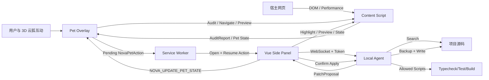

# NOVA Browser Agent 技术架构

## 1. Monorepo

```text
nova-browser-agent/
├── apps/
│   ├── extension/          WXT + Vue 3 + TresJS 浏览器扩展
│   └── playground/         原 NOVA Nuxt 3D 宠物与审计实验页
├── packages/
│   ├── shared/             审计数据与 WebSocket 协议
│   └── local-agent/        Node.js 本地项目 Agent
├── docs/                   产品、架构、安全、协议与开发文档
└── pnpm-workspace.yaml
```

## 2. 浏览器扩展

### Background Service Worker

职责：

- 打开 Side Panel。
- 接收 Content Script 的审计结果。
- 按标签页将最新报告写入 `chrome.storage.local`。
- 在 Side Panel 和 Content Script 之间转发必要状态。
- 将动物触发的 Side Panel 动作暂存到 `chrome.storage.local`，避免 Side Panel 初始化延迟造成命令丢失。

Service Worker 不保存唯一状态，避免休眠后丢失。

### Content Script

运行范围：`http://*/*` 与 `https://*/*`。

职责：

- 在 `document_start` 建立 LCP、CLS、Long Task 观察器。
- 页面就绪后执行 DOM 与资源审计。
- 在浏览器空闲阶段挂载 Shadow DOM 隔离的 Vue + TresJS 3D 云狐。
- 维护云狐快捷菜单、当前问题索引、预览状态和动画反馈。
- 将高风险工程动作委托给 Background 与 Side Panel。
- 绘制问题元素高亮层。
- 保存临时预览快照并支持撤销。

不负责：

- 读取本地源码。
- 写入项目文件。
- 执行任意页面脚本。
- 读取本地源码或直接执行任意项目命令。

### 网页内 3D Pet Overlay

职责：

- 固定在宿主网页右下角并允许拖拽。
- 将单击、双击、右键、悬停转换为受约束的 `NovaPetAction`。
- 直接执行页面审计、问题切换、定位、预览和撤销。
- 将 Agent 连接、补丁生成、写入、验证和回滚委托给 Side Panel。
- 接收 Side Panel 返回的 `NOVA_UPDATE_PET_STATE`，同步动作、文案与忙碌状态。

### Side Panel

职责：

- 展示页面健康度、指标、问题列表。
- 向 Content Script 发送定位与预览指令。
- 直接连接本机 WebSocket Agent。
- 展示源码候选、Diff、应用、回滚和检查结果。
- 消费 Service Worker 保存的待执行动物动作。
- 将 Local Agent 状态同步回网页内 3D 云狐。

Three.js/TresJS 由网页内 Pet Overlay 使用，并通过 Shadow DOM 与宿主页面隔离。组件在浏览器空闲阶段初始化，Canvas 使用透明背景和受限 DPR。

## 3. 审计引擎

当前规则：

| 分类 | 规则 |
|---|---|
| 无障碍 | 图片 alt、表单标签、按钮名称、链接名称、标题层级 |
| 性能 | 图片尺寸、首屏以下懒加载、大型资源、慢导航、Long Task |
| SEO | document title、meta description |
| DOM | 重复 ID、DOM 规模 |

评分规则：

```text
初始 100
高优先级 -12
中优先级 -6
低优先级 -2
最低为 0
```

评分是排序提示，不替代 Lighthouse 或真实用户监控。

## 4. 本地 Agent

本地 Agent 仅监听：

```text
127.0.0.1:<port>
```

启动时：

1. 解析并 `realpath` 项目根目录。
2. 检查目录可读写。
3. 从 `.nova/agent.json` 读取或生成连接口令。
4. 检测包管理器、框架与项目脚本。
5. 启动 WebSocket 服务。

### 源码映射

浏览器问题会携带：

- CSS selector
- tagName
- outerHTML 片段
- id、name、placeholder、src、href、text
- 搜索关键词和偏好扩展名

Agent 在以下源码中搜索：

```text
.vue .tsx .jsx .html .svelte .astro
```

排除：

```text
node_modules .git .nuxt .output dist build coverage
```

每个候选根据关键词出现次数和稳定程度评分。找不到高置信度目标时，只返回候选文件，不生成可应用补丁。

### 补丁生命周期

```text
PROPOSED
  ├─ canApply=false → 仅提供建议/候选
  └─ canApply=true
       ↓ 用户确认
     APPLIED
       ├─ run checks
       └─ rollback
```

写入前检查：

- 路径必须位于项目根目录。
- 当前文件 SHA-256 必须与生成补丁时一致。
- 先写 `.nova/backups/<patch-id>.json`。
- 不允许任意文件路径由浏览器直接指定。

回滚前检查：

- 当前文件必须仍与补丁后的 SHA-256 一致。
- 若开发者已继续编辑，拒绝自动覆盖。

## 5. 确定性修复规则

MVP 自动补丁仅处理：

- `image-alt-missing`
- `image-dimensions-missing`
- `image-lazy-missing`
- `form-label-missing`
- `button-name-missing`
- `link-name-missing`

其它问题只返回候选文件和人工建议。

## 6. 检查执行

允许脚本固定为：

```text
typecheck
test
build
```

Agent 从 `package.json` 判断脚本是否存在，并通过检测到的包管理器执行：

```text
pnpm run <script>
npm run <script>
yarn run <script>
bun run <script>
```

不接收浏览器提供的命令文本，不使用 Shell 拼接，默认超时 120 秒并限制输出长度。

## 7. 数据流



## 8. 动物动作路由

`NovaPetAction` 是浏览器交互层的有限动作集合：

```text
audit
previous-issue
next-issue
preview-current
rollback-preview
open-report
connect-agent
generate-patch
apply-patch
run-checks
rollback-patch
```

前五项由 Content Script 在当前页面直接处理；其余动作由 Service Worker 持久化后交给 Side Panel。浏览器动物不能携带任意代码、命令文本或文件路径。
