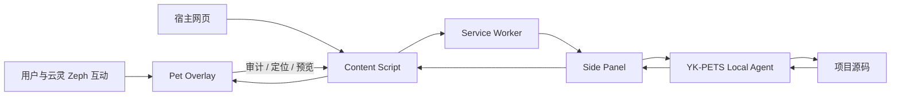

# YK-PETS Browser Agent 技术架构

## 1. 产品、宠物与实现分层

YK-PETS 从 `v0.6.10` 平台分支开始明确区分：

```text
产品品牌：YK-PETS
宠物身份：云灵 / Zeph
宠物物种：云狐 / Cloud Fox
当前渲染实现：Vue + TresJS 程序化 3D 模型
```

产品功能和协议不得依赖宠物名字。物种专属动作可以由具体宠物实现，但必须通过能力声明和降级策略接入。

## 2. Monorepo

```text
yk-pets/
├── apps/
│   ├── extension/          WXT + Vue 3 + TresJS 浏览器扩展
│   └── playground/         3D 宠物与审计实验页
├── packages/
│   ├── shared/             品牌、宠物身份、审计数据与通信协议
│   └── local-agent/        Node.js 本地项目 Agent
├── docs/                   产品、架构、安全、协议与开发文档
└── pnpm-workspace.yaml
```

`@nova/*` 私有 Workspace scope 在本阶段仅作为 `v0.6.10` 兼容边界保留。新增公共领域模型使用 YK-PETS 命名。

## 3. 共享领域层

`packages/shared/src/brand.ts` 定义：

- `YK_PETS_BRAND`；
- `PetIdentity`；
- `ZEPH_CLOUD_FOX_IDENTITY`；
- 本地化名字与物种格式化函数。

`PetIdentity` 独立包含：

```text
id          zeph
speciesId   cloud-fox
name        云灵 / Zeph
species     云狐 / Cloud Fox
```

`packages/shared/src/messages.ts` 的规范类型为：

- `YkPetAction`；
- `YkPetBehavior`；
- `YkPetVisualState`；
- `YkPetVoicePreset`；
- `YkPetsRuntimeMessage`。

旧 `Nova*` 类型通过弃用别名继续可用。`NOVA_*` Wire Message 暂时保持不变，避免一次品牌迁移同时破坏 Background、Content Script 和 Side Panel 的通信。

## 4. 浏览器扩展

### Background Service Worker

职责：

- 打开 Side Panel；
- 接收 Content Script 的审计与网络结果；
- 按标签页持久化报告和待执行动作；
- 在 Side Panel 与 Content Script 之间转发状态；
- 提供 TTS 和扩展级能力。

Service Worker 不保存唯一内存状态，避免休眠后丢失。

### Content Script

职责：

- 在 `document_start` 建立性能观察器；
- 执行 DOM、资源、无障碍和基础性能审计；
- 在 Shadow DOM 中挂载云灵的 3D 覆盖层；
- 维护问题定位、临时预览与动作反馈；
- 把高风险工程操作委托给 Background 和 Side Panel。

### YK-PETS 品牌兼容层

`apps/extension/brand.ts` 集中处理：

- 旧用户可见 NOVA 文案到 YK-PETS 的替换；
- 将宠物相关显示转换为云灵（Zeph）；
- 普通 DOM 与开放 Shadow Root 的持续观察；
- `nova:*` 到 `yk-pets:*` 的初次迁移；
- 新旧 Storage Key 的双向镜像。

该层是一个明确的过渡边界，后续逐组件重命名时可以删除，而不是让替换逻辑散落在业务代码中。

### 网页内 3D Pet Overlay

职责：

- 固定在宿主网页右下角并允许拖拽；
- 将单击、双击、右键、悬停转换为受约束的宠物动作；
- 直接执行审计、问题切换、定位、预览和撤销；
- 将 Agent 连接、补丁生成、写入、验证和回滚委托给 Side Panel；
- 根据系统状态驱动云灵的情绪、动作、语音和提示。

### Side Panel

职责：

- 展示页面健康度、指标和问题列表；
- 管理审计规则与 Network Lab；
- 连接本机 WebSocket Agent；
- 展示源码候选、Diff、应用、回滚和检查结果；
- 同步执行状态回网页内宠物。

## 5. 宠物身份与动作模型

通用系统状态和物种专属动作必须分开：

```text
通用状态：idle, thinking, happy, confused, excited, listening
通用意图：greet, inspect, celebrate, warn, rest, play
云狐动作：tail-tornado, antenna-charge, tail-glow 等
```

当前 `YkPetBehavior` 仍包含历史动作值，以保持 `v0.6.10` 稳定。下一阶段应由 `PetDefinition` 将通用意图解析为具体动作：

```ts
interface PetDefinition {
  identity: PetIdentity
  capabilities: readonly string[]
  resolveIntent(intent: string): string
  loadRenderer(): Promise<unknown>
}
```

## 6. 审计引擎

当前规则覆盖：

- 无障碍：图片 alt、表单标签、按钮名称、链接名称、标题层级；
- 性能：图片尺寸、懒加载、大型资源、慢导航、Long Task；
- SEO：标题与描述；
- DOM：重复 ID 与 DOM 规模；
- 最佳实践：Viewport 与混合内容。

评分用于排序和解释，不替代 Lighthouse 或真实用户监控。

## 7. 本地 Agent

本地 Agent 仅监听：

```text
127.0.0.1:<port>
```

启动时：

1. 解析并验证项目根目录；
2. 优先读取 `.yk-pets/agent.json`；
3. 如果仅存在 `.nova/agent.json`，迁移原 Token 和端口；
4. 检测包管理器、框架和允许脚本；
5. 启动 Token 认证的 WebSocket 服务。

主 CLI 为 `yk-pets-agent`，`nova-agent` 暂时保留为兼容别名。

## 8. 安全边界

- 浏览器宠物只发送有限动作，不携带任意命令、源码或文件路径；
- Local Agent 只访问明确指定的项目根目录；
- 文件写入前检查路径与 SHA-256；
- 必须由用户确认后才应用补丁；
- 只允许运行 `typecheck`、`test` 和 `build`；
- 写入前创建备份，源码继续变化时拒绝覆盖或回滚。

## 9. 数据流



## 10. 下一步平台结构

```text
packages/
├── pet-core/          框架无关状态、事件、调度和生命周期
├── pet-cloud-fox/     云狐能力、动作、资源和渲染器
├── pet-web/           DOM、Shadow DOM 和普通 JavaScript API
├── pet-web-component/ <yk-pet> 标准组件
└── adapter-*/         React、Vue、Svelte 等薄适配层
```

当前云灵实现将作为第一个 `PetDefinition` 被迁移，而不是继续作为唯一宠物写死在核心中。
