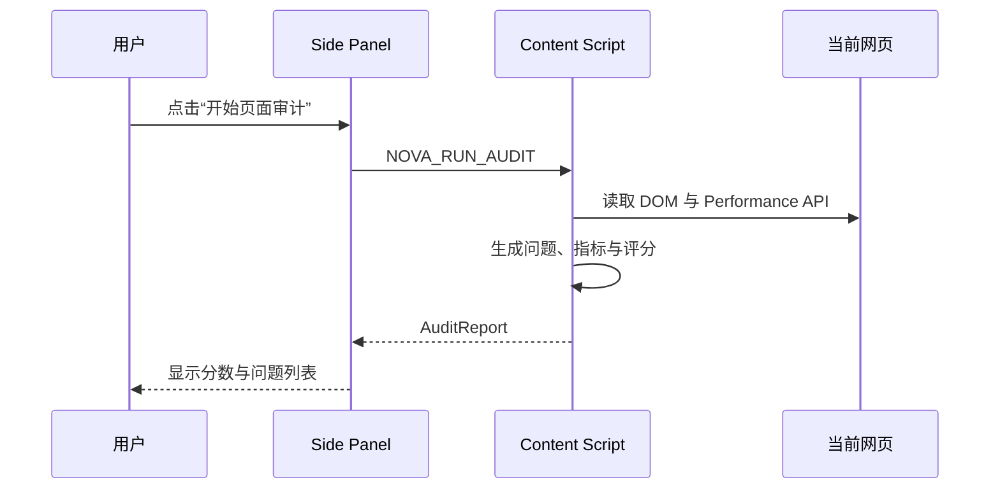
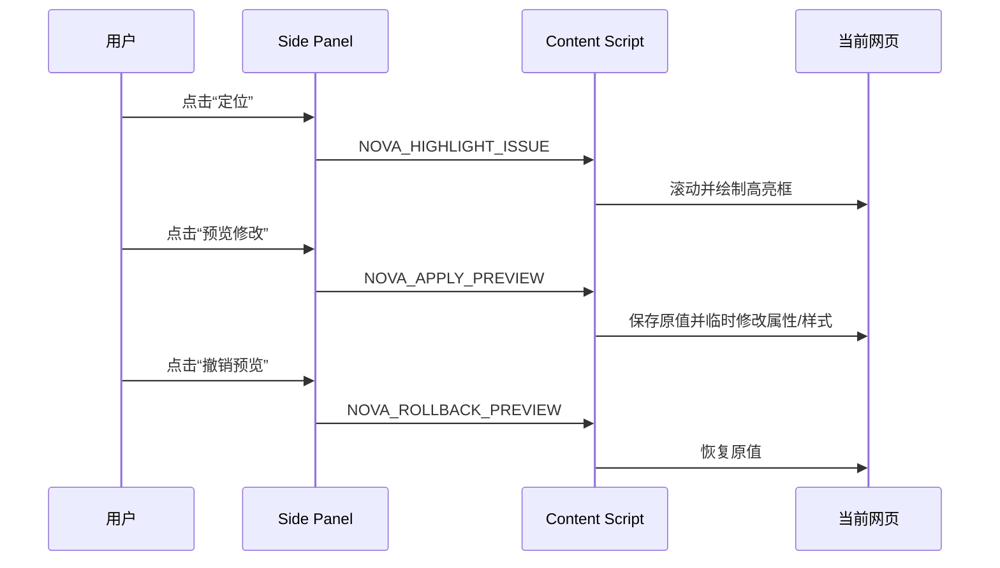
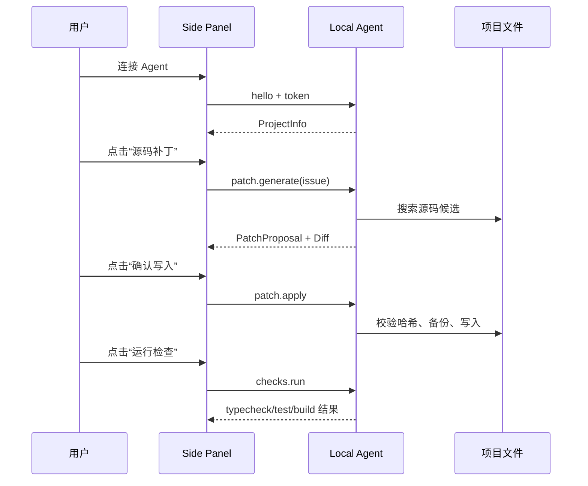

# NOVA Browser Agent 产品与交互设计

## 1. 产品定义

NOVA Browser Agent 是一个住在允许扩展运行网页右下角的 3D 前端工程 Agent。用户通过点击、双击、右键、悬停和拖拽云狐即可发起审计、导航问题、预览修复和工程操作；Side Panel 负责展示详细报告、Diff 与命令输出。连接本地 CLI 后，可在用户确认的前提下把建议映射到源码、生成最小补丁、执行检查并回滚。

产品核心链路：

```text
观察网页 → 解释问题 → 定位元素 → 临时预览 → 生成源码补丁 → 用户确认 → 验证 → 保留或回滚
```

NOVA 云狐不是装饰，它承担系统状态反馈：

| 系统状态 | 云狐表现 |
|---|---|
| 未开始审计 | 靠近倾听 |
| 正在审计 | 思考、核心脉冲 |
| 页面健康 | 开心、尾巴摇动 |
| 高优先级问题 | 疑惑、歪头 |
| 正在生成补丁 | 思考、环绕光加速 |
| 补丁已应用 | 兴奋庆祝 |
| 页面状态较差 | 趴下休息 |

## 2. 目标用户

### 前端开发者

希望在开发 localhost 项目时快速发现可验证的问题，并在不离开浏览器的情况下定位到源码、生成差异和运行项目脚本。

### 产品、设计与测试人员

希望对测试环境或线上页面进行可视化检查，快速指出具体元素并预览修改效果，不要求具备代码编辑能力。

### 技术负责人

希望将检查结果转化为可重复的工程流程，并确保任何自动修改都可审阅、可验证、可回滚。

## 3. MVP 目标

本版本实现：

1. 在普通 HTTP/HTTPS 网页右下角注入可交互的 3D NOVA 云狐。
2. 单击、双击、右键、悬停和拖拽动物均有明确交互语义。
3. 页面审计、问题切换、定位、预览、补丁、验证与回滚都能从动物交互发起。
4. 通过浏览器工具栏按钮、动物菜单或网页入口打开 Side Panel。
3. 对当前页面执行 DOM、无障碍、SEO、资源和基础性能审计。
4. 在原网页中高亮问题元素。
5. 对安全的属性修改提供即时预览和撤销。
6. 通过 `ws://127.0.0.1:4736` 连接本地 Agent。
7. 使用稳定特征搜索源码候选文件。
8. 为有限、确定性较高的问题生成最小源码补丁。
9. 必须由用户点击确认后才写入文件。
10. 可执行 `typecheck`、`test`、`build` 三类允许脚本。
11. 可在源码未继续变化时安全回滚。

本版本不实现：

- 任意 AI 生成代码并自动执行。
- 无确认写入。
- 任意 Shell 命令。
- 浏览器页面与源码的百分之百精确映射。
- DevTools Protocol 深度性能分析。
- 跨设备远程 Agent。

## 4. 信息架构

产品由两个协作表面组成：

```text
网页右下角 3D NOVA
├── 动物状态与自然语言反馈
├── 页面审计
├── 上一个/下一个问题
├── 定位与临时预览
├── 详细报告入口
└── 本地工程工具箱

Side Panel
├── 当前页面与健康度
├── 指标与完整问题列表
├── Local Agent 连接配置
├── 源码候选与补丁 Diff
├── 确认写入/回滚
└── Typecheck/Test/Build 输出
```

网页内动物是主交互入口；Side Panel 是详细信息和高风险确认区。

## 5. 核心用户流程

### 5.0 动物主入口

```text
单击云狐 → 展开快捷功能
双击云狐 → 立即审计
右键云狐 → 打开工程工具箱
拖拽云狐 → 调整网页内位置
```

完整交互规范见 [网页内 3D NOVA 交互设计](./PET-INTERACTION.md)。


### 5.1 页面审计



### 5.2 元素定位与临时预览



### 5.3 源码修复



## 6. 视觉系统

### 色彩

| Token | 值 | 用途 |
|---|---|---|
| `--surface-0` | `#080a12` | 主背景 |
| `--surface-1` | `#0f1220` | 面板 |
| `--surface-2` | `#0b0f1c` | 卡片 |
| `--accent` | `#7066ff` | 主操作、云狐光环 |
| `--success` | `#52e0d0` | 健康、连接成功 |
| `--warning` | `#ffd36a` | 中优先级 |
| `--danger` | `#ff6f8f` | 高优先级 |
| `--text` | `#edf0ff` | 主文字 |
| `--muted` | `#929abb` | 辅助文字 |

### 形状与层级

- Side Panel 使用 12–24px 圆角，强调设备面板感。
- 高优先级问题使用左侧红色状态条，不单独依赖颜色文字。
- Diff 使用等宽字体并在侧边栏宽度内安全换行，避免整个插件出现横向滚动。
- 操作按钮明确区分“临时预览”和“写入源码”。

### 动效

- 动效只用于状态变化，不作为唯一信息载体。
- 3D 云狐存在于宿主网页右下角，并在浏览器空闲阶段初始化。
- 透明 Canvas、受限 DPR 和低幅度空闲动画用于控制运行开销。
- `prefers-reduced-motion` 下关闭菜单过渡并降低动作表现。

## 7. 文案原则

- 不使用“自动修好了”这类绝对表述。
- 明确区分“网页临时预览”和“项目源码修改”。
- 当源码映射不可靠时，显示候选文件与原因，不伪造确定性。
- 失败文案说明下一步，如“刷新目标网页”“重新生成补丁”“源码已变化”。

## 8. 无障碍要求

- Side Panel 的所有操作必须可键盘访问。
- 图标按钮必须有文本或 `aria-label`。
- 健康度、严重级不能只靠颜色表达。
- 宿主页面高亮层 `pointer-events: none`，不能阻断页面交互。
- 定位标签优先显示在目标元素外部；空间不足时自动在上、下、左、右之间避让，不能覆盖目标内容。
- 网页内 3D 云狐通过 Shadow DOM 隔离，并为动物、快捷菜单和工程工具提供可访问名称。
- 双击与右键仅作为快捷方式，所有功能同时提供可键盘操作按钮。

## 9. 成功指标

MVP 验收指标：

- 用户在 30 秒内通过云狐完成首次页面审计。
- 所有可用功能都能从动物菜单或动物快捷交互发起。
- 云狐可以拖拽，但不会移出可视区域。
- 问题卡片可准确滚动定位到目标元素，定位标签不遮挡目标内容。
- Side Panel 在 280px 及以上宽度不出现页面级横向滚动。
- 临时预览可以完全撤销，不残留属性或内联样式。
- 本地 Agent 只能访问指定根目录。
- 未确认时本地 Agent 不写入源码。
- 补丁生成后源码变化时拒绝覆盖。
- 应用后的补丁可以回滚。
- Chrome MV3 扩展可以完成生产构建。
