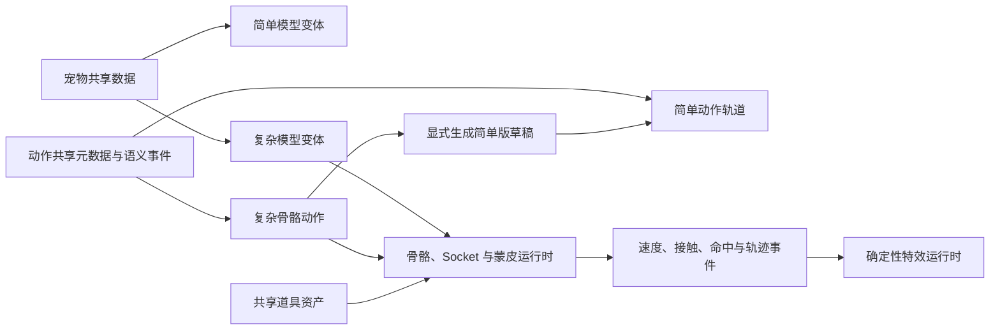

# 双模型工坊与复杂动作交互设计

## 目标

在保留当前程序化简单模型及其编辑能力的前提下，为同一只宠物增加复杂蒙皮骨骼模型。简单模型面向轻量运行、快速编辑和兼容回退；复杂模型面向可信的骨骼动作、IK、足底接触、Root Motion、道具约束和运动驱动特效。

本设计优先减少用户操作：

- 系统能够可靠推导、映射、生成或校验的内容默认自动完成；
- 常用流程直接呈现结果，高级参数按需展开；
- 只有存在歧义、自动结果置信度不足或会覆盖人工成果时，才要求用户选择；
- 自动生成始终写入新草稿，不覆盖已经人工编辑的模型或动作变体；
- 错误提示必须说明影响并提供直接修复入口，不让用户从禁用按钮猜测原因。

## 已验证的现状与根因

当前云狐是由 Three.js/TresJS 几何体程序化拼装的节点模型，不是 `SkinnedMesh + Skeleton`：

- 前肢接近“整根前肢 + 爪尖”，缺少肩、上臂、肘、前臂和腕部骨骼；
- 后肢只有整体旋转，缺少髋、膝、小腿、踝、脚掌和脚趾的独立关节；
- 身体缺少骨盆、脊柱和胸腔层级，无法表达重心传递；
- 前爪 IK 只是二维作者辅助工具，不是带关节限制和持续末端约束的运行时 IK；
- 道具挂点来自外观比例计算的固定位置，没有读取运动后骨骼的世界矩阵；
- 动画轨道逐轴计算 Euler 标量，缺少 Quaternion Clip、足底锁定、动作重定向和 Motion Warping；
- 现有特效主要由固定时间事件驱动，没有以速度、加速度、轨迹、接触和命中作为输入。

因此，继续给简单模型增加关键帧可以提高卡通编排复杂度，但不能达到可信的屈膝、蹬地、落地缓冲、持械约束和关节蒙皮效果。

## 产品关系

### 同一宠物的双模型模式

采用同一宠物资产下的两种模型变体：

- **简单模型**：保留现有程序化外观、语义动作通道和轻量预览能力；
- **复杂模型**：增加骨骼、蒙皮、Morph、IK、接触约束、Root Motion 和高级特效能力。

名称、身份、配色、表情语义、材质语义、动作元数据、音乐、语义事件和道具定义属于共享层。程序化部件参数与复杂模型的骨骼、蒙皮、Morph、Socket 和物理参数属于模型专属层。

模型切换不会创建另一只宠物，也不会静默转换或覆盖另一模型变体。

### 一个动作资产包含两个变体

同一动作资产包含：

- 共享的名称、时长、循环方式、音乐、语义事件和道具依赖；
- 简单模型使用的参数轨道变体；
- 复杂模型使用的骨骼 Clip、IK、接触、Root Motion 和特效变体。

复杂动作可以生成简单动作初稿，但生成结果先写入独立草稿，用户确认保存后才替换目标变体。简单和复杂动作都可以继续独立编辑。

## 方案比较

### 方案 A：同一工作区按模型模式自适应（采用）

外观、动作、道具和资产库保持统一 Studio 壳。顶部模型模式决定当前画布、属性页签、轨道类型和可用辅助工具。

优点：

- 沿用现有页面结构、快捷键和用户心智；
- 简单与复杂能力边界始终可见；
- 共享状态和双变体状态容易表达；
- 不需要维护两套导航和编辑器框架。

### 方案 B：简单与复杂使用两套独立编辑器（放弃）

独立编辑器允许复杂模式自由布局，但会复制导航、资产选择、预览工具、保存流程和快捷键，用户也难以理解两边共享哪些数据。

### 方案 C：只保留复杂编辑器，简单模型运行时自动降级（放弃）

运行时降级操作最少，但无法保证程序化简单模型的动作质量，也会丢失用户现有的简单动作编辑能力。自动降级仍保留为显式生成工具，不作为唯一数据来源。

### 辅助的新建向导

引导式流程不作为独立编辑器，只用于首次创建复杂模型或复杂动作。创建完成后进入统一工作区，专业用户无需反复经过向导。

## 全局信息架构

### 顶部模型模式

Studio 顶部上下文区增加稳定的分段选择器：

- `简单模型`
- `复杂模型`

它是全局编辑上下文，不是只改变画布的预览开关。切换后同步更新：

- 当前渲染模型；
- 左侧资产和层级信息；
- 右侧属性页签；
- 时间轴轨道类型；
- 画布辅助工具；
- 模型与动作变体完整度。

切换不丢失草稿，也不弹出无意义确认框。若当前变体尚不存在，工作区显示页面内创建引导。

### 状态表达

模型切换器、资产卡和发布面板统一显示：

- `就绪`：必需数据完整；
- `可编辑但不完整`：允许继续编辑，同时说明缺失能力和影响；
- `阻断复杂变体发布`：根骨骼、蒙皮或关键引用无效；
- 简单/复杂动作变体是否存在；
- 模型或动作完整度；
- 特效和渲染性能警告。

复杂变体的问题只阻断复杂变体，不影响简单模型的编辑和发布。

## 外观工坊

### 共享区域

名称、配色、表情、材质语义和预览环境继续使用相同控件。修改共享数据后，两种模型立即预览相同语义结果。

### 简单模型区域

保留现有程序化几何、头部、身体、前后爪、尾巴、耳朵、触角和表面挂载编辑。

### 复杂模型区域

按需显示：

- 骨骼层级和关节朝向；
- 骨骼比例与关节范围；
- 蒙皮覆盖和异常权重诊断；
- Morph Target 映射；
- 材质槽位映射；
- 手、脚、头、尾巴和道具 Socket；
- 简单外观语义到复杂模型的映射状态。

系统自动执行骨骼命名匹配、左右侧识别、基础材质映射、权重异常扫描和 Socket 初始定位。低置信度项目集中进入“需要处理”列表，不要求用户逐项浏览所有高级参数。

## 动作工坊

### 简单动作模式

保留现有部件树、参数关键帧、曲线、移动、旋转、缩放和直接操控。

### 复杂动作模式

左侧显示可搜索、可折叠的骨骼与约束树；中央画布支持直接选择骨骼和末端控制器；右侧属性按当前对象显示；底部时间轴按以下轨道组折叠：

- 骨骼；
- IK 约束；
- 足底与其他接触；
- Root Motion；
- 特效事件；
- 道具约束；
- 音频。

### 画布直接操控

- 点击骨骼显示旋转 Gizmo；
- 点击手腕、脚踝等末端显示 IK 控制点；
- 拖动末端时系统自动求解关节并遵守角度限制；
- 支撑脚在接触区间内自动锁定；
- 持械动作自动保持手腕与道具握点约束；
- 骨骼、IK 控制点、接触点、重心和运动轨迹可以分别显示或隐藏；
- `W/E/R`、撤销、重做、播放和保存快捷键在两种模型模式下保持一致。

复杂参数默认收起。通常只显示当前选中对象和当前动作阶段需要的控制项。

### 复杂动作创建

系统按以下优先级提供三个入口：

1. **从简单版生成初稿**：默认入口，自动映射根节点、头部、四肢、尾巴、表情和共享事件；
2. **导入动画 Clip**：自动分析骨骼并展示重定向预览，只要求处理无法可靠匹配的骨骼；
3. **从空白创建**：用于完全手工制作。

生成初稿后，系统继续自动完成：

- 关键姿态重采样；
- Quaternion 曲线生成；
- 关节限制修正；
- 足底接触候选检测；
- 支撑脚锁定；
- Root Motion 候选提取；
- 手与道具握点匹配；
- 速度峰值、落地、旋转和命中候选事件识别；
- 可撤销的特效建议。

自动判断置信度不足时以候选标记呈现，用户可以一次接受、局部调整或忽略。

## 道具工坊与特效

道具几何、材质、语义挂载和资产 ID 在两种模型间共享。

### 简单模型

继续使用语义近似挂点和固定事件，保证兼容和轻量运行。

### 复杂模型

道具可绑定真实骨骼 Socket，并定义：

- 单手或双手握点；
- 局部朝向；
- 碰撞体；
- 轨迹采样点；
- 特效发射器；
- 与动作约束的关系。

特效允许使用以下触发源：

- 骨骼或道具速度；
- 加速度和方向突变；
- 脚掌触地；
- 拳脚或道具命中；
- 起跳和落地；
- 旋转峰值；
- 显式语义事件。

系统根据触发源自动生成拖尾、残影、尘土、火花、冲击波或能量环初稿。用户通常只需要选择风格预设；发射率、寿命、宽度和衰减等高级参数收进展开区。

时间轴拖动和重复播放必须确定性重建特效，避免每次预览结果不同。

## 自动化优先规则

### 默认自动完成

- 创建复杂模型时复制共享外观语义；
- 骨骼命名、左右侧和层级识别；
- 骨骼映射、动作重定向和基础 Socket 定位；
- 简单动作到复杂动作的初始映射；
- 复杂动作到简单动作的显式草稿生成；
- 足底接触、支撑脚和 Root Motion 候选识别；
- 道具握点和双手约束候选；
- 运动峰值与特效触发候选；
- 骨骼、蒙皮、引用和性能校验；
- 自动保存当前工作区草稿与切换状态。

### 仅在必要时请求用户处理

- 一个源骨骼可能匹配多个目标骨骼；
- 自动动作重定向产生明显穿插或关节反转；
- 同一动作存在多个合理的支撑脚或道具握法；
- 自动降级会覆盖已经人工编辑的简单动作；
- 导入资产缺少授权、关键骨骼或有效蒙皮；
- 特效超出性能预算但无法安全自动降级。

### 渐进披露

- 默认界面只显示常用工具和当前选择对象；
- 专业参数放入“高级”展开区；
- 诊断面板默认只列出需要处理的项目；
- 批量问题提供“一键接受建议”和可撤销结果；
- 新建向导完成后不再强制重复经过步骤页面。

## 数据流

共享数据和模型专属数据必须由明确接口隔离。简单模型继续通过现有程序化渲染器工作；复杂模型使用独立骨骼渲染适配器；Studio 通过统一预览接口选择当前适配器。

## 创建与发布流程

### 创建复杂模型

1. 用户切换到复杂模型；
2. 若变体不存在，系统在当前页面显示“创建复杂模型”；
3. 系统复制共享外观并自动导入或建立骨骼映射；
4. 自动运行骨骼、蒙皮、Morph、材质和 Socket 校验；
5. 仅列出无法可靠处理的问题；
6. 达到最低完整度后即可编辑，达到发布门槛后允许发布。

### 双变体对比

默认使用单画布保证编辑空间。画布工具栏提供临时“并排对比”，用于检查：

- 共享外观语义是否一致；
- 动作节奏和事件是否一致；
- 简单版降级是否保留主要动作意图；
- 道具和特效是否在两种模式下合理。

### 发布检查

发布面板分别显示简单与复杂变体：

- 外观、模型、动作和道具完整度；
- 关键引用和版本兼容；
- 骨骼、蒙皮、约束和穿插问题；
- 特效粒子、拖尾和残影预算；
- 简单模型回退是否可用。

用户可以只发布简单变体，也可以同时发布双变体。

## 异常处理

- 切换模型时保留两边独立草稿和撤销栈；
- 自动生成失败时保留原资产，并给出失败阶段和重试入口；
- 导入模型不满足骨骼或蒙皮要求时允许保存为未完成变体；
- 缺少非关键骨骼时降级对应能力，例如关闭尾巴物理，而不是让整个模型不可编辑；
- 运行时加载复杂模型失败时回退简单模型，并保留动作共享事件；
- 特效超出预算时优先降低粒子密度、拖尾采样和残影数量，不改变动作时序；
- 用户启用 `prefers-reduced-motion` 时关闭非必要残影、闪烁和高密度粒子。

## 响应式与可访问性

- 桌面端保持资产、画布、属性三栏结构；
- 窄屏将左右栏收进抽屉，画布和播放控制保持首要位置；
- 模型切换器具有明确名称、当前状态和键盘焦点；
- 骨骼树、轨道组和状态提示支持键盘导航；
- 颜色不是区分就绪、警告和错误的唯一手段；
- IK 控制点、关键帧和轨迹节点提供稳定点击尺寸；
- 减少动态效果设置不影响编辑数据和动作时间。

## 兼容与迁移

- 当前程序化模型和动作资产保持有效，不要求一次性迁移；
- 新的宠物和动作资产容器增加可选复杂变体，不改变简单变体语义；
- 首次打开旧资产时不自动创建复杂数据；
- 用户主动创建复杂变体后才运行映射；
- 复杂转简单始终生成草稿，不覆盖人工简单动作；
- 运行时优先使用用户或场景指定模型，复杂变体不可用时安全回退简单模型。

## 验证与验收

### 数据与状态

- 模型切换不丢失未保存修改；
- 两种模型专属数据互不覆盖；
- 共享数据在两种模式中一致；
- 自动生成、接受建议和批量修复均可撤销；
- 复杂变体错误不会阻断简单变体。

### 动作与约束

- Quaternion 动画在完整旋转和循环边界无跳变；
- 支撑阶段足底无明显滑动；
- 膝肘遵守关节限制，不出现反向折叠；
- 持械时手腕与握点保持约束；
- Root Motion 与角色可见位移一致；
- 时间轴拖动、播放和逐帧检查结果一致。

### 特效

- 特效跟随真实骨骼或道具世界轨迹；
- 接触、命中、速度峰值和旋转事件触发准确；
- 重放和拖动时间轴可以确定性重建；
- 低配降级不改变动作节奏和关键事件；
- 性能面板能够定位超预算发射器。

### UI 与响应式

- 三个工坊的顶部模型模式、预览工具和快捷键一致；
- 高级功能默认不干扰简单工作流；
- 未完成状态说明具体影响和修复入口；
- 桌面与窄屏无横向溢出，抽屉、时间轴和画布可操作；
- 键盘焦点、状态名称、对比度和减少动态效果符合项目规范。

## 分阶段实施边界

1. 双模型资产容器、顶部模型模式和统一预览适配器；
2. 复杂模型导入、骨骼映射、蒙皮校验和 Socket；
3. Quaternion Clip、动作重定向、运行时 IK、足底锁定和 Root Motion；
4. 复杂动作时间轴、直接操控和自动动作初稿；
5. 运动驱动特效、确定性预览和性能预算；
6. 双变体对比、自动降级草稿和独立发布检查。

每个阶段必须保留简单模型可用，不以未完成的复杂能力替换当前正式路径。
