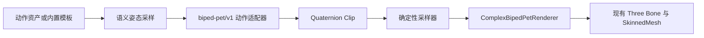

# 双足萌宠语义动作编译设计

## 1. 目标

在不要求用户理解骨骼名称、Euler、Quaternion、绑定或蒙皮的前提下，让复杂双足萌宠直接消费动作工坊的语义姿态，并提供第一组可复用的真实骨骼动作：待机呼吸、行走循环、起跳与落地、招手、直拳组合。

本批建立从“动作意图”到“骨骼 Quaternion”的稳定链路。简单模型继续消费原有语义通道；复杂模型消费相同动作资产编译出的骨骼姿态，两者共享动作名称、时间、循环、道具事件和编辑流程。

## 2. 已确认边界

### 本批完成

- 框架无关的 `biped-pet/v1` 语义动作适配器；
- 版本化 Quaternion Clip、骨骼轨道、根节点局部位移、接触候选和语义事件契约；
- 对动作工坊现有 `EvaluatedCloudFoxPose` 的确定性编译；
- Quaternion 最短路径插值、关节限制钳制、损坏输入诊断和中性姿态回退；
- 五个基础动作模板及速度、力度、幅度、情绪和循环参数；
- 复杂 Three 运行时的播放、拖动时间指针、暂停、停止和切换动作消费链路；
- 简单模型行为与已有动作资产兼容。

### 本批不完成

- 运行时 IK 与持续末端约束；
- 足底锁定和步态 Motion Warping；
- 可见世界位移形式的完整 Root Motion；
- 舞蹈、完整功夫套路、球类运动和持械动作；
- 粒子、残影、冲击波等动作驱动特效；
- 人类、四足动物和机甲 Profile。

本批可以输出接触、位移和事件候选，但不得把候选描述成上述能力已经完成。

## 3. 方案比较

### 方案 A：Profile 专属 Quaternion Clip（采用）

领域层把语义姿态或动作模板编译为与渲染框架无关的骨骼 Quaternion Clip。Three 运行时只负责采样并写入骨骼。

优点：确定性强、可测试、可进入时间轴、能遵守关节限制，并为后续 IK、足底锁定和其他 Profile 保留正确边界。代价是需要新增编译、采样和运行时适配三层。

### 方案 B：运行时直接映射旧 Euler 通道（放弃）

优点是代码少；缺点是旋转顺序和跨体型语义混在渲染层，关节限制难以统一，后续仍需重写。

### 方案 C：在渲染循环中写死动作（放弃）

优点是短期视觉效果快；缺点是不能编辑、保存或稳定回放，也无法成为新人可复用的动作生产能力。

## 4. 领域模型

新增 `biped-pet-motion-adapter/v1`，输入由两类入口统一产生：

1. 动作工坊在当前时间得到的 `EvaluatedCloudFoxPose`；
2. 内置动作生成器按模板、持续时间和风格参数生成的语义关键姿态。

编译结果包含：

- `profileId`、`adapterId`、`durationMs`、循环方式和稳定哈希；
- 每根已写入骨骼的 Quaternion 关键帧；
- 根节点局部位移关键帧；
- 左右脚接触候选区间；
- 起跳、落地、挥手峰值和出拳命中等语义事件；
- 按稳定顺序输出的 warning/error 诊断。

Quaternion 必须为有限单位四元数；同一骨骼同一时间只保留最后一个有效关键帧；相邻关键帧使用最短路径球面插值。编译器不得引用 Vue、Three.js、DOM 或浏览器 API。

## 5. 语义映射

- `root.*` 映射根骨骼局部位移与旋转；
- `body.*` 分配到骨盆、下脊柱、上脊柱和胸腔，避免单骨骼承担全部扭转；
- `head.*` 分配到颈部与头部；
- 前爪旋转映射到锁骨、上臂、肘、前臂和腕部，爪尖映射到手部；
- 后爪旋转映射到髋、大腿、膝、小腿、踝和脚；
- 尾巴、耳朵和触角只在对应可选骨骼存在时写入；缺失可选链是兼容情况，不作为错误；
- 表情通道继续由简单模型消费，本批复杂程序化网格尚无 Morph，不伪造表情骨骼。

所有角度先按 Profile 语义映射，再由 `jointLimits` 钳制；不允许在 Three 组件中散落额外角度规则。

## 6. 五个基础动作

### 待机呼吸

持续约 3.6 秒循环。骨盆轻微上下浮动，胸腔与头部错相呼吸，耳尾带低幅滞后，避免机械同步。

### 行走循环

持续约 1.2 秒循环。左右腿和手臂反相摆动，骨盆横移与转动形成重心交换；输出左右脚接触候选，但本批不锁脚。

### 起跳与落地

持续约 2.4 秒单次播放。包含预压、蹬伸、腾空、落地压缩和恢复五阶段，并输出起跳与落地事件。

### 招手

持续约 3.2 秒单次播放。包含抬臂、两次腕部摆动、停留和回落；躯干与头部提供低幅反向配平。

### 直拳组合

持续约 4 秒单次播放。包含防守准备、蓄力、前手试探、后手直拳、命中停顿、回收和恢复；骨盆、胸腔和肩带按动力链错峰旋转，并输出命中事件。

速度改变总时长；力度主要影响动力链和命中停顿；幅度影响关节目标但仍受限制；情绪只选择经过测试的节奏与姿态系数，不接受任意脚本表达式。

## 7. 运行时与数据流

`CloudFoxStudioCanvas` 继续是唯一预览入口。复杂 renderer 获得当前语义姿态或已编译 Clip，在现有 runtime 创建完成后按骨骼 ID 写入 Quaternion 与根节点局部位移。停止播放或切换资产时恢复绑定姿态；重建模型时新 runtime 从当前时间重新采样，不保留旧骨骼引用。

## 8. 失败与兼容策略

- Profile 不匹配、骨骼引用缺失、非有限数或非法 Quaternion 产生结构化诊断；
- error 级诊断阻止该 Clip 应用并恢复中性绑定姿态，不销毁复杂模型配方；
- 缺失耳、尾或触角只产生可忽略 warning；
- 动作资产缺少某些通道时，对应骨骼保持绑定姿态；
- 简单模型、道具事件、材质策略、预览旋转与现有本地存储格式保持兼容；
- 不新增网络请求、浏览器权限、GLB 依赖或第二个 WebGL 场景。

## 9. 测试与验收

领域测试至少覆盖：

- 五个模板的稳定时长、阶段、事件和确定性哈希；
- Quaternion 单位长度、最短路径插值和边界时间；
- 所有已写入骨骼存在于 Profile 且角度遵守关节限制；
- 不同体型配方复用同一 Profile 时结果稳定；
- 可选链缺失、坏输入、重复关键帧和缺失语义的恢复行为；
- 行走左右相位、起跳五阶段、招手重复摆动和直拳动力链的关键姿态断言。

运行时测试至少覆盖绑定姿态快照、采样写入、停止恢复、runtime 重建、卸载释放和无旧骨骼引用。浏览器验收覆盖动作工坊播放/暂停/拖动/停止、五个动作可见差异、简单与复杂切换、道具随骨骼、刷新恢复、1440×900 与 760×900 无横向溢出及控制台无应用错误。

跨浏览器 GPU/WebGL 最终像素、运行时 IK、足底锁定、Root Motion 和特效继续作为独立后续验收，不由本批自动测试替代。
