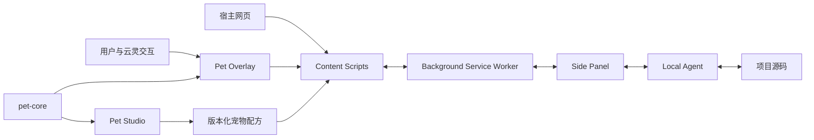

# YK-PETS Browser Agent 技术架构

## 1. 架构目标

YK-PETS 将产品品牌、宠物身份、宠物物种和渲染实现分开建模。当前默认宠物是云狐云灵（Zeph），但审计、记忆、网络工具、Local Agent 和通用动作协议不得依赖某个宠物名字。

架构优先保证：跨页面与 Service Worker 重启后的状态可靠性、领域逻辑可独立测试、浏览器与本地源码之间的安全边界、唯一正式 3D 渲染链路，以及旧 `NOVA` 技术标识的渐进兼容。

## 2. Monorepo 结构

```text
yk-pets/
├── apps/
│   ├── extension/             WXT + Vue 3 浏览器扩展
│   └── playground/            Nuxt Playground 与 Pet Studio
├── packages/
│   ├── shared/                跨运行时协议、审计、网络和记忆模型
│   ├── local-agent/           本地 WebSocket Agent
│   ├── pet-core/              框架无关宠物、动作和道具领域
│   ├── pet-vue-adapter/       Vue 渲染适配器
│   └── pet-web-component/     <yk-pet> Custom Element 外壳
├── scripts/                   架构契约与专项回归门禁
├── docs/                      中英文产品与工程文档
└── .ai/                       机器可读状态与会话交接
```

完整依赖用途见[技术栈详解](./技术栈.md)。

## 3. 分层和依赖方向

```text
Presentation  Vue 页面、组件、Side Panel、Content Overlay
Application   用例编排、Composables、动作调度和服务
Domain        审计规则、网络规则、动作、道具、配方和状态合同
Infrastructure Chrome API、DOM、WebSocket、文件系统和 Local Storage
```

依赖必须由外向内：Domain 不依赖 Vue、Chrome API、DOM、WebSocket 或文件系统；基础设施通过明确接口把数据送入应用层。跨包数据先验证或规范化，UI 不直接修补不可信输入。

## 4. 浏览器扩展

### 4.1 Background Service Worker

Background 负责 Side Panel 生命周期、标签页级报告和动作状态、Content 与 Side Panel 消息转发、TTS 及扩展级命令。持久状态写入 `chrome.storage`，不把 Service Worker 内存当作唯一事实源。

### 4.2 Content Scripts

Content 层负责：

- 在 `document_start` 建立性能和网络观察能力；
- 执行 DOM、可访问性、SEO、资源和基础性能审计；
- 在 Shadow DOM 中挂载云灵覆盖层和高亮层；
- 执行问题导航及可撤销 DOM 预览；
- 在隔离世界与页面主世界之间桥接 Fetch/XHR；
- 接收 Studio 外观配方并同步到正式宠物运行时。

网页 DOM、属性、网络响应和审计证据均视为不可信数据。

### 4.3 Side Panel

Side Panel 是工程操作和长任务入口，承载审计报告、Network Lab、宠物记忆、运行偏好、Local Agent 连接、源码候选、Diff、写入、验证和回滚。网页内宠物只发出白名单动作，不绕过 Side Panel 的确认边界。

### 4.4 Network Lab

Network Lab 按 Domain、Application、Infrastructure、Presentation 分层。规则工厂、匹配、冲突检测和值克隆保持纯逻辑；Chrome Repository 和页面通道处理平台细节；Vue Composable 和页面只负责编排与展示。

## 5. Playground 与 Pet Studio

Nuxt Playground 同时承担审计实验、宠物互动演示和 Studio 创作环境。统一 Studio 包含：

- `/studio/appearance`：外观配方与部件编辑；
- `/studio/motion`：动作资产、时间轴、曲线、动作层和直接操控；
- `/studio/props`：参数化道具、层级、材质、锚点和本地 GLB；
- `/studio/library`：外观、动作和道具资产管理。

Pinia Store 保存本地 Studio 会话和版本化资产。外观、动作和道具互相引用但保持独立身份；删除道具时清理动作依赖，动作姿态不改写外观配方。

## 6. 唯一 3D 渲染链路

唯一正式云狐组合为：

```text
apps/playground/app/components/studio/ExtensionAlignedCloudFox.vue
```

统一预览入口为 `CloudFoxStudioCanvas.vue`，扩展通过 WXT Alias 复用正式组合。`ProceduralPet.vue` 根据物种注册分派渲染器；场景效果、道具实例、洋葱皮和运动轨迹都复用同一 TresCanvas。

动作消费链路：

```text
StudioMotionAssetV2
  -> normalizeMotionAsset
  -> resolveMotionTime
  -> evaluateNormalizedMotionAsset
  -> EvaluatedCloudFoxPose
  -> CloudFoxStudioCanvas
  -> ProceduralPet
  -> ExtensionAlignedCloudFox
  -> 语义部件适配器
```

每帧只求值一次。未写入动作通道继续使用程序化呼吸、眨眼、视线和表情。

## 7. 共享领域包

### `packages/pet-core`

负责物种定义、版本化配方信封、渲染器注册、Studio 同步、语义 Rig、动作时间、关键帧、插值、动作层、直接操控命令、道具实体和事件轨道。所有关键行为都能在无浏览器环境中确定性测试。

### `packages/shared`

负责品牌与身份、审计报告、扩展消息、Local Agent 协议、网络规则、宠物记忆和运行偏好。`@nova/shared` 名称仅作为 `v0.6.10` Workspace 兼容边界保留。

### 渲染适配器

`pet-vue-adapter` 把框架无关渲染器合同接到 Vue，`pet-web-component` 提供 `<yk-pet>` 标准元素外壳。适配器保持薄层，不复制领域规则。

## 8. Local Agent

Local Agent 只监听 `127.0.0.1`，首条消息必须完成 Token `hello` 认证。它负责：

1. 解析并固定项目根目录；
2. 识别框架、包管理器和允许脚本；
3. 根据审计证据搜索受限源码候选；
4. 生成确定性最小补丁和 Diff；
5. 在用户确认后校验 SHA-256、备份并写入；
6. 运行白名单检查或在哈希安全时回滚。

浏览器不能传入任意 Shell、绝对文件路径或远程脚本。

## 9. 主要数据流



## 10. 状态和存储

- `chrome.storage`：扩展报告、规则、记忆、运行偏好和兼容镜像；
- Local Storage：Playground 的外观、Studio 会话、动作和道具资产；
- `.yk-pets/agent.json`：Local Agent 端口与 Token；
- `.nova/`：旧配置迁移和当前补丁备份的兼容边界；
- 内存状态：播放指针、临时草稿、连接会话和未应用补丁。

任何持久化格式变更都必须提供规范化、迁移或兼容读取路径。

## 11. 安全与失败边界

- 页面与导入数据进入领域前必须验证；
- Shadow DOM 只降低样式冲突，不构成安全沙箱；
- 补丁生成、应用、验证和回滚是不同操作；
- 扩展或 Agent 重启后，内存补丁和会话可能失效，必须明确提示；
- 静态门禁不能代替 Chrome、Side Panel、GPU、WebGL 和音频人工验收。

详细威胁模型见[安全设计与威胁模型](./安全设计.md)。

## 12. 当前演进边界

已完成框架无关动作和道具领域、四工作区 Studio、统一云狐渲染、扩展配方同步及基础 Web Component。当前重点是浏览器验收、截图基线和发布加固；真实模型射线拾取与三轴 3D Gizmo 尚未完成。
