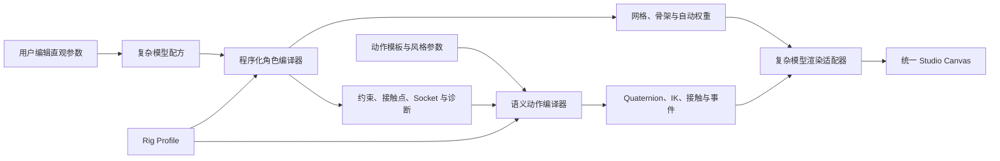

# 站内参数化角色与自动 Rig 设计

## 1. 目标

让不了解 3D 绑定、蒙皮和骨骼命名的新手，直接在 YK-PETS 网站内完成角色模型和配套动作。用户只编辑体型、外观、动作意图和风格，系统自动完成几何生成、骨架建立、蒙皮权重、关节限制、IK、动作曲线、接触约束和基础特效事件。

模型与动作只服务于本站 Three.js/TresJS 渲染逻辑，不承担 GLB、FBX 或其他 DCC 软件格式的导入导出兼容。

本设计继续遵守以下原则：

- 能可靠推导的内容由程序自动完成；
- 普通用户不接触骨骼名称、权重画笔和绑定步骤；
- 高级诊断按需展开，不阻断正常创建流程；
- 自动生成失败时保留上一个可用版本；
- 简单模型和复杂模型的数据互不覆盖；
- 第一版专注双足萌宠，同时保证领域接口可扩展到人形、四足和机甲。

## 2. 产品边界

### 2.1 本站是角色生成器，不是网页版 Blender

用户可以：

- 选择体型与外观模板；
- 调整身高、头身比、肩宽、腰宽和四肢比例；
- 配置手脚、耳朵、尾巴、触角和材质；
- 选择动作模板并调整速度、力度、幅度、情绪和循环方式；
- 在外观、动作和道具工坊中直接预览、编辑和保存。

用户不需要：

- 导入或导出宠物模型文件；
- 创建骨架或维护骨骼层级；
- 绘制或修复蒙皮权重；
- 理解 Quaternion、IK、Root Motion 等实现术语；
- 使用外部 3D 软件完成必要步骤。

道具工坊已有的安全本地 GLB 能力仍只用于道具资产，不扩展为宠物复杂模型导入入口。

### 2.2 第一版与长期范围

第一版正式实现 `biped-pet/v1` 双足萌宠体型。长期支持范围包括：

- `humanoid/v1`：人形；
- `quadruped/v1`：四足动物；
- `mech/v1`：机甲与刚性关节角色。

这些体型共享动作语义和工坊交互框架，但不强制共享完全相同的骨骼拓扑、接触模型和关节约束。

## 3. 方案比较

### 3.1 固定标准 Rig、参数化模型与程序自动蒙皮（采用）

为每种体型维护版本化 Rig Profile。用户编辑模型配方，程序生成标准骨架、网格、蒙皮权重、约束和 Socket。

优点：

- 不要求用户具备绑定和蒙皮知识；
- 模型比例变化后可以重新生成全部派生数据；
- 同一体型内动作容易复用和适配；
- 数据量小，便于撤销、持久化和升级；
- 能在本站运行时中保持确定性。

### 3.2 分段木偶模型（不作为复杂模型终态）

每段几何直接挂在关节节点下，不生成连续蒙皮。

该方案实现快，但肩、肘、髋和膝的形变容易出现玩具感。可以作为生成失败时的诊断预览，不作为复杂模型正式渲染路径。

### 3.3 浏览器自由建模与任意拓扑自动绑定（放弃）

该方案需要自由网格编辑、重拓扑、权重生成和大量异常修复，复杂度接近完整 DCC 工具，与“减少操作步骤”的产品目标冲突。

## 4. Rig Profile 架构

Rig Profile 描述某一类体型的结构与求解能力，不保存具体角色外观：

```ts
interface CharacterRigProfile {
  id: 'biped-pet/v1' | 'humanoid/v1' | 'quadruped/v1' | 'mech/v1'
  topology: RigTopologyDefinition
  optionalChains: OptionalRigChainDefinition[]
  jointLimits: JointLimitDefinition[]
  contacts: ContactDefinition[]
  sockets: SocketDefinition[]
  skinningRules: SkinningRuleDefinition[]
  motionAdapter: MotionAdapterDefinition
}
```

### 4.1 统一语义层

所有 Profile 通过语义角色与动作系统通信：

- Root、重心和朝向；
- 头部、视线和胸腔；
- 左右主要肢体与末端；
- 支撑点、接触点和命中点；
- 道具握点与发射点；
- 可选附属骨骼链；
- 表情和共享语义事件。

动作资产不得依赖 `fox_left_arm_02` 等具体骨骼名称，而应表达“左手向前”“右脚支撑”“胸腔向左旋转”等语义目标。

### 4.2 `biped-pet/v1`

第一版包含：

- Root、骨盆、三段脊柱、胸腔、颈部和头部；
- 左右锁骨、上臂、肘、前臂、手腕和手部；
- 左右髋、大腿、膝、小腿、脚踝、脚掌和脚趾；
- 可选耳朵、尾巴、触角和翅膀骨骼链；
- 左右手、左右脚、头部、背部和尾巴根部 Socket；
- 双脚接触、重心和基础碰撞范围；
- 每个关节的安全角度范围和默认弯曲方向。

人形 Profile 可以复用双足核心语义，但拥有不同的比例范围、休息姿态、肩髋结构和关节限制。四足与机甲使用独立拓扑和求解器。

## 5. 模型配方

复杂模型不持久化运行时网格和骨骼矩阵，只保存版本化模型配方：

```ts
interface CharacterModelRecipeV1 {
  schemaVersion: 1
  generatorVersion: 'biped-pet-generator/v1'
  rigProfileId: 'biped-pet/v1'
  bodyStyle: 'soft' | 'athletic' | 'round' | 'slender'
  proportions: {
    height: number
    headRatio: number
    shoulderWidth: number
    hipWidth: number
    torsoLength: number
    armLength: number
    legLength: number
    handSize: number
    footSize: number
  }
  appendages: {
    ears?: EarRecipe
    tail?: TailRecipe
    antennae?: AntennaRecipe
  }
  materials: MaterialRecipe[]
  updatedAt: number
}
```

模型配方必须支持规范化、安全范围限制、撤销重做、自动保存和版本迁移。极端输入由系统限制到当前 Profile 的安全范围，并给出直接可理解的原因。

## 6. 程序化角色编译器

角色编译器是 UI 和渲染器无关的纯领域能力：

```text
模型配方
  → Rig Profile 实例
  → 标准骨架
  → 分区域程序化网格
  → 自动蒙皮权重
  → 关节限制与默认姿态
  → IK 长度、接触点与 Socket
  → 诊断和完整度
```

### 6.1 几何生成

- 躯干按骨盆、腰部和胸腔生成连续顶点环；
- 手臂按肩、上臂、肘、前臂和手腕生成渐变截面；
- 腿部按髋、大腿、膝、小腿、脚踝和脚掌生成；
- 关节区域保留足够顶点环，避免弯曲时塌陷；
- 头部和附属部件可采用刚性挂载或局部蒙皮；
- 可选骨骼链由对应部件配方决定段数和长度。

### 6.2 自动蒙皮

- 根据顶点到相邻骨骼段的距离生成候选权重；
- 使用关节影响区在相邻骨骼间平滑过渡；
- 每个顶点最多受 4 根骨骼影响；
- 权重必须归一化且不允许 NaN、负数或空影响；
- 关节附近进行体积保持修正；
- 编译器输出权重覆盖率、异常顶点数和最大影响数诊断。

### 6.3 确定性与失败恢复

相同配方、Profile 和生成器版本必须得到相同编译结果。新结果通过全部最低校验后才替换当前可用运行时；失败时保留上一个版本，并允许恢复默认安全比例。

## 7. 语义动作系统

### 7.1 动作数据

动作保存用户意图和可重新求解的数据：

- Root 位移和朝向；
- 骨盆、胸腔和头部姿态；
- 手脚末端目标；
- 肘膝弯曲方向；
- 支撑与接触区间；
- 尾巴、耳朵和表情语义；
- 道具约束；
- 速度峰值、落地、命中和旋转事件。

Profile 的 Motion Adapter 将语义姿态求解为实际骨骼 Quaternion、Root Motion 和约束结果。

### 7.2 自动动作生成

动作模板由阶段组成。例如直拳包括准备、蓄力、出拳、命中、回收和恢复。用户调整速度、力度、幅度、情绪和循环后，系统自动重建：

- 阶段时长；
- 关键姿态；
- Quaternion 曲线；
- 支撑脚和重心；
- IK 目标；
- 命中和特效事件。

第一批基础动作：

1. 待机呼吸；
2. 行走循环；
3. 起跳与落地；
4. 招手；
5. 直拳组合。

舞蹈、完整功夫套路、持械动作和运动驱动特效在基础 Rig、接触和动作求解稳定后继续扩展。

## 8. 工坊交互

### 8.1 外观工坊

复杂模式默认展示：

- 体型模板；
- 身高、头身比和躯干比例；
- 肩宽、腰宽和四肢比例；
- 手脚、耳朵、尾巴和触角；
- 材质、颜色和外观风格；
- 模型生成状态和直接修复入口。

修改参数后防抖自动编译和预览，不提供“绑定”“绘制权重”等操作。

### 8.2 动作工坊

默认展示动作模板卡片与速度、力度、幅度、情绪和循环。系统生成完整时间轴后，用户可以播放、保存或进入高级编辑。

高级模式可以显示骨架、接触点、IK 目标和诊断，但这些不是创建动作的必要步骤。

### 8.3 道具工坊

复杂模型读取真实骨骼 Socket 的世界变换。普通用户选择“左手”“右手”“双手”或“背部”等语义位置，系统完成局部对齐和基础约束。

## 9. 渲染边界

继续使用现有 `CloudFoxStudioCanvas` 和唯一 TresJS 场景：

- 简单模式使用现有程序化云狐渲染器；
- 复杂模式使用站内骨骼角色渲染适配器；
- 不创建第二个 Canvas 或长期并行场景；
- 模型、动作、道具和特效共享同一时间与坐标系；
- 复杂渲染失败时回退简单模型，并明确显示失败阶段。

TresJS 只承载渲染对象。模型配方、Rig Profile、编译器、动作求解和诊断不得依赖 Vue 组件，以便进行无 GPU 单元测试。

## 10. 数据流



## 11. 异常处理

- 配方损坏时迁移可识别字段，其余回退默认值；
- 几何或权重编译失败时保留上一个可用模型；
- 动作求解产生非有限数值时回退默认姿态；
- 极端比例自动收敛到安全范围；
- 可选骨骼链失败时只关闭对应能力；
- 复杂模型故障只阻断复杂变体，不影响简单模型；
- 用户可以一键恢复当前 Profile 的默认模型；
- 所有失败提示说明影响、自动处理结果和可执行修复入口。

## 12. 第一批实施范围

1. `biped-pet/v1` Rig Profile 领域契约；
2. `CharacterModelRecipeV1` 及安全规范化；
3. 双足萌宠骨架、关节限制、接触点和 Socket 生成；
4. 躯干与四肢程序化网格；
5. 自动蒙皮权重和诊断；
6. 复杂模型运行时适配器；
7. 外观工坊体型模板和比例编辑；
8. 五个可随比例重新求解的基础动作；
9. 动作速度、力度、幅度、情绪和循环参数；
10. 模型与动作配方持久化；
11. 简单模型回退与复杂模型状态更新；
12. 桌面、窄屏和真实浏览器验收。

## 13. 暂不实现

- 宠物模型 GLB、FBX 等格式导入导出；
- 浏览器自由雕刻和任意拓扑编辑；
- 手工权重画笔；
- 人形、四足和机甲正式生成器；
- 复杂布料、毛发和软体物理；
- 外部动画文件重定向。

## 14. 验收标准

### 14.1 新手工作流

- 用户不接触骨骼名称、权重或绑定步骤即可创建复杂模型；
- 首次进入复杂模式自动产生可用默认模型；
- 选择动作模板后直接得到可以播放和保存的动作；
- 常规流程不出现必须展开的高级参数。

### 14.2 模型与 Rig

- 修改允许范围内的头身比、躯干和四肢比例后自动重新生成；
- 权重有效且归一化，不出现 NaN、负权重或无影响顶点；
- 骨骼层级、关节限制、接触点和 Socket 完整；
- 相同输入能够确定性重建；
- 编译失败不会覆盖上一个可用模型。

### 14.3 动作

- 五个基础动作适配所有允许的双足萌宠比例；
- 行走支撑阶段无明显脚底漂移；
- 起跳、落地和直拳遵守关节限制；
- 时间轴拖动、播放和重复播放结果一致；
- 动作失败时不产生无效骨骼矩阵。

### 14.4 兼容与界面

- 简单与复杂模型互不覆盖；
- 复杂模型故障时简单模型仍可编辑和播放；
- 三个工坊共享同一复杂模型和动作状态；
- 桌面与窄屏无横向溢出；
- 状态、错误和自动修复入口可通过键盘访问；
- 不新增宠物模型上传、网络轮询或外部文件依赖。

## 15. 后续阶段

1. 扩充舞蹈、功夫、运动和持械动作模板；
2. 加入运行时 IK、足底锁定和更完整 Root Motion；
3. 加入由速度、接触、命中和轨迹驱动的确定性特效；
4. 建立 `humanoid/v1` 人形 Profile；
5. 建立 `quadruped/v1` 四足 Profile；
6. 建立 `mech/v1` 机甲 Profile；
7. 完成双变体对比、自动降级草稿和独立发布检查。
